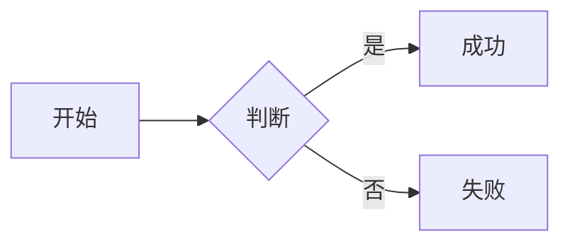
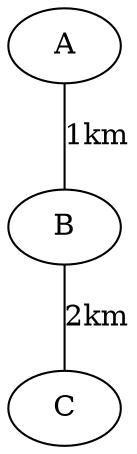

+++
title = '文章编写示例（写作模板）'
date = 2026-08-03
draft = true
tags = ["写作", "模板", "示例"]
categories = ["笔记"]
summary = '本站写作速查手册：Frontmatter、基础排版、数学/化学公式、代码块、表格、图片组织、作者 AI 标记、常见坑点。新建文章时复制本文为起点。'
author = "wunai"

+++

# 注意：该文章已废弃，最新内容请阅读 [《博客书写规范》](/zh/groups/博客书写规范/)

> 用绝对路径而不是原来的 `[博客书写规范.md]`：后者是相对 `.md` 链接，会被渲染器改写为
> `/zh/posts/博客书写规范/`，而该文已拆成卡组并迁到 `/zh/groups/博客书写规范/`，旧写法会变成死链。

> **文件存放位置**：`content/zh/posts/你的文章名.md`（中文文件名 OK）。`draft = true` 不会被部署上线，要发布改为 `false` 或删除该行。
>
> 给 AI 的提示：**严格保持 ` ```语言名 ` 在同一行，不要拆分；表格内用 `\lvert` `\rvert` 代替 `|`**。

---

## 一、Frontmatter（文件头，必写）

**TOML 格式（推荐，`+++` 包裹，必须在文件第 1 行，前面不能有空行）**：

```toml
+++
title = '文章标题'
date = 2026-08-03
draft = false
tags = ["标签1", "标签2"]
categories = ["分类"]
summary = '一句话摘要，显示在文章列表卡片上'
author = "wunai"   # 或 "AI"，见下一节
showToc = true     # 可选：强制显示/隐藏目录
# pinned: true      # 可选：置顶
# [cover]           # 可选：卡片右侧缩略图（不写则自动取正文第一张图）
#   image = "/images/xxx/cover.png"
#   caption = "图源：..."
+++
```

### 字段一览

| 字段 | 必填 | 说明 |
|------|:----:|------|
| `title` | ✅ | 文章标题（H1，正文里不要再写 `# 标题`） |
| `date` | ✅ | 发布日期，影响排序。**时间越早排得越靠后**，想让文章靠前就把 date 写新一点 |
| `draft` | - | `true`=草稿不发布，`false`=发布（不写默认 false） |
| `author` | - | 控制视觉标记，详见「二、作者信息与 AI 标记」 |
| `tags` | - | 标签数组，多个用逗号分隔 |
| `categories` | - | 分类数组 |
| `summary` | - | 列表页卡片上的摘要文字，不写则自动截取正文前 N 字 |
| `pinned` | - | `true` 时首页置顶显示 |
| `about` | - | `true` 时作为「关于」文章：正文直接渲染在首页首屏，并从首页展示位中排除 |
| `hiddenInHomeList` | - | `true` 时不在首页列表显示（但 URL / 分类页仍可访问） |
| `[cover]` | - | 卡片缩略图配置块：`image`（不写则取正文第一张图）/ `hidden` |

---

## 二、作者信息与 AI 标记（核心规则）

`author` 字段**不只是署名**，它还控制首页卡片颜色和详情页警示徽章，必须按事实填写。

### 取值对照

| 写法 | 首页卡片 | 详情页徽章 | 适用场景 |
|------|---------|-----------|---------|
| `author = "AI"` | 标题/摘要/日期**整体变蓝** | 🔴 **红色胶囊**：「注意⚠️ 本文由 AI 生成，可能存在误区，斟酌阅读！！」 | AI 生成/整理/润色/扩写；有人工校对也建议标 AI |
| `author = "wunai"` | 正常黑白灰 | ⚪ **灰色胶囊**：「作者：wunai」 | wunai 原创 |
| `author = "其他"` | 正常黑白灰 | ⚪ **灰色胶囊**：「作者：其他」 | 转载标注、笔名等 |
| **不写 `author`** | 正常黑白灰 | **无徽章** | 继承站点默认 author |

> **大小写不敏感**：`"ai"` `"Ai"` `"aI"` 都等同于 `"AI"`。

### 判断标准：什么时候标 AI？

**如果读者看到文章不是 AI 生成的会惊讶，就应该标 AI。**

| 情况 | 是否标 AI |
|------|:--------:|
| 全文 AI 生成，仅人工改错别字/格式 | ✅ 标 AI |
| 人类给大纲 + 素材，AI 行文 | ✅ 标 AI |
| NotebookLM AI 概览 / Source 整理 | ✅ 标 AI |
| AI 初稿 + 人工修改 >50%（加入大量个人经验） | ✅ 仍建议标 AI（文末可注明"AI 初稿 + 人工深度改写"） |
| 纯人工逐字写 | ❌ 写 `"wunai"` 或不写 |
| 翻译外文 + AI 辅助翻译 | ✅ 标 AI（纯人工翻译不标） |

### 打印/导出 PDF 时的作者显示

- `author = "AI"` → 红色徽章**不打印**（不进入 PDF 范围）
- `author = "wunai"` / 其他 → 灰色徽章**保留显示**
- 不写 `author` → 本就无徽章，不显示

---

## 三、基础 Markdown 速查

### 3.1 标题层级

```markdown
## 二级标题        ← 正文从二级开始（title 已经是 H1）
### 三级标题
#### 四级标题
```

### 3.2 文本样式

```markdown
**粗体**    *斜体*    ***粗斜体***    ~~删除线~~
`行内代码`
[超链接文字](https://example.com)
<https://example.com>    ← 自动链接
==黄色高亮==             ← GitHub 扩展，本站支持
```

效果：**粗体** · *斜体* · ***粗斜体*** · ~~删除线~~ · `行内代码` · [超链接文字](https://example.com) · 这是==重点内容==

### 3.3 列表

```markdown
- 无序项 1
- 无序项 2
  - 子项（缩进两个空格或 Tab）

1. 有序项一
2. 有序项二

- [x] 已完成任务
- [ ] 未完成任务
```

### 3.4 引用块

```markdown
> 这是一级引用
>
> > 这是嵌套引用
>
> **提示**：常用前缀 **提示/** / **警告/** / **注意/**
```

### 3.5 脚注

```markdown
这是一个观点[^mynote]。

[^mynote]: 脚注内容，可以写在 md 任意位置（建议文末）。
```

> ⚠️ **脚注编号必须全局唯一**，不能和其他脚注重名。Hugo 会按正文首次出现顺序重新编号为 1..N。

### 3.6 其他内联元素

```markdown
<kbd>Ctrl</kbd> + <kbd>C</kbd> 复制

<small>小字说明文字</small>

<sub>下标</sub> 和 <sup>上标</sup>
```

效果：<kbd>Ctrl</kbd> + <kbd>C</kbd> 复制 · <small>小字说明</small> · H<sub>2</sub>O、100<sup>2</sup>

### 3.7 引用上标标记（`[reference:N]`，AI 自动生成无需处理）

从 NotebookLM 等 AI 工具复制的 `[reference:1]` 会被自动渲染为可点击上标编号，不用手动删除或转换。

---

## 四、代码块

### 4.1 语法：围栏 + 语言名（同一行！）

````markdown
```python
def fib(n):
    a, b = 0, 1
    for _ in range(n):
        yield a
        a, b = b, a + b
```
````

> **⚡ 致命坑**：` ```python ` 的 `python` 必须**紧跟反引号在同一行**。AI 常把语言名单独换行（` ``` ` 下一行再写 `python`），会导致**语法高亮完全丢失**。发现代码块没有颜色，先查这一点。

### 4.2 常用语言名

```javascript
const sum = (a, b) => a + b;
```
```bash
brew install hugo
hugo server -D
```
```sql
SELECT id, name FROM users WHERE active = true;
```
```go
package main
import "fmt"
func main() { fmt.Println("Hello!") }
```
```json
{ "name": "wunai", "age": 18 }
```
```toml
title = '文章标题'
date = 2026-08-03
```
```yaml
title: "文章标题"
date: 2026-08-03
```

> 代码块右上角悬停有「复制」按钮。

---

## 五、表格

### 5.1 基础

```markdown
| 姓名 | 年龄 | 城市 |
|------|------|------|
| 张三 | 25 | 北京 |
| 李四 | 30 | 上海 |
```

### 5.2 对齐

```markdown
| 左对齐 | 居中 | 右对齐 |
|:-------|:----:|-------:|
| 左     |  中  |     右 |
```

### 5.3 ⚠️ 表格中的绝对值符号 `|` 必须转义

表格单元格是用 `|` 分隔的，如果内容里写 `$y = |f(x)|$`，里面的 `|` 会被误判为列分隔符，**表格会错乱**。

**错误写法（会错位）：**

```markdown
| 解析式 |
|--------|
| $y = |f(x)|$ |   ← 单元格里的 | 会破坏表格结构
```

**正确写法（用 `\lvert` / `\rvert`）：**

```markdown
| 解析式 |
|--------|
| $y = \lvert f(x) \rvert$ |
```

`\lvert` 和 `\rvert` 在 KaTeX 下渲染效果和 `|` 完全一样，且不会和 Markdown 分隔符冲突。**任何表格内的绝对值、范数、分段函数边界都用这两个命令。**

同样坑的符号：**化学公式里的下标 `_` 在表格行内**要用 `\_{}` 转义（见 7.2 节）。

---

## 六、图片与文件组织

### 6.1 单文件写法（简单文章）

图片放 `public/images/你的目录/` 下，正文用**以 `/` 开头的绝对路径**引用（`public/` 就是 URL 的根）：

```markdown

*图 1：动物细胞结构。图源：XXX*
```

<small>图源说明可以用 `<small>` 包起来让字号小一点</small>

### 6.2 文件夹写法（长文 + 多图推荐）

```
content/zh/posts/我的文章/
├── index.md          ← 正文（frontmatter 写这里）
├── cover.png         ← 封面（`cover.image = "cover.png"`）
├── 1-插图.jpg        ← 任意随文图片
└── 附件.pdf          ← 任意资源
```

> ⚠️ 注意区分：**`index.md`**（单篇文件夹，本篇正文）vs **`_index.md`**（卡组说明，见 6.3）。
> 一个文件夹里两者同时存在时，按卡组处理。

正文用相对路径引用：

```markdown


[下载 PDF](./附件.pdf)
```

> **从单文件升级到文件夹**：新建同名文件夹 → 原 `.md` 改名为 `index.md` → 配图搬进来 → 路径改成 `./xxx`。**URL 完全不变**，不影响 RSS/搜索/外链。

### 6.3 卡组（同一主题多篇）

把多篇文章归为一组：建一个同名文件夹，里面放一个 **`_index.md`** 作组说明，其余 `.md` 就是组内文章。

```
content/zh/posts/Java编程教程/
├── _index.md          ← 必需；写 title / description / cover
├── 01-Java简介.md
├── 02-基础语法.md
└── ...
```

`_index.md` 示例：

```yaml
---
title: "Java 编程教程"
description: "从语法到实战的一组笔记。"
cover:
  image: "/images/java/cover.png"
---
```

| 行为 | 说明 |
|------|------|
| 组内排序 | 写 `order` 最优先；没写则按文件名数字前缀（`01-`、`02-`）；再没有按文件名 |
| 在文章页（`/zh/posts/`） | 渲染为一张**叠层卡片**，与其他文章混排；鼠标移上去的光标效果与普通卡片不同 |
| 在首页 | **不显示**——卡组与组内文章都不上首页 |
| 卡组位置 | 用**组内最新一篇文章的日期**参与排序（组本身没有日期） |
| 上一篇 / 下一篇 | **组内只在组内接续，组外只在组外接续**，两边不互通 |
| 组内文章 URL | 仍是 `/zh/posts/<文件名>/`（不带组名） |
| 归档 / 标签 / 搜索 | 组内文章照常单篇出现 |

点卡片进入 `/zh/groups/<组名>/` 可看到组内全部文章（按顺序，带序号）。封面图填满卡片边框内部。

---

## 七、数学公式（KaTeX）

### 7.1 行内与块级

```markdown
质能方程 $E = mc^2$ 是爱因斯坦提出的。

$$
\int_{-\infty}^{\infty} e^{-x^2} \, dx = \sqrt{\pi}
$$
```

### 7.2 表格内的公式

`|` → `\lvert` / `\rvert`（见第五节，**最重要**）

### 7.3 常用示例

**矩阵**：
$$
\begin{bmatrix}
a & b \\
c & d
\end{bmatrix}
\begin{bmatrix}
x \\
y
\end{bmatrix}
=
\begin{bmatrix}
ax + by \\
cx + dy
\end{bmatrix}
$$

```latex
\begin{bmatrix} a & b \\ c & d \end{bmatrix}
```

**分段函数**：
$$
f(x) = \begin{cases} x^2, & x \geq 0 \\ -x, & x < 0 \end{cases}
$$

```latex
f(x) = \begin{cases} x^2, & x \geq 0 \\ -x, & x < 0 \end{cases}
$$

**求和与极限**：
$$
\sum_{n=1}^{\infty} \frac{1}{n^2} = \frac{\pi^2}{6}, \quad \lim_{x \to 0} \frac{\sin x}{x} = 1
$$

---

## 八、化学符号（mhchem）

用 `\ce{...}` 包裹，行内和块级都行。

### 8.1 化学式

```markdown
水是 $\ce{H2O}$，食盐是 $\ce{NaCl}$，硫酸是 $\ce{H2SO4}$。
```

效果：水是 $\ce{H2O}$，食盐是 $\ce{NaCl}$，硫酸是 $\ce{H2SO4}$。

### 8.2 化学方程式

```latex
$$\ce{2H2 + O2 -> 2H2O}$$
$$\ce{N2(g) + 3H2(g) <=>[高温、高压][催化剂] 2NH3(g)}$$
$$\ce{Ag+ + Cl- -> AgCl v}$$      ↓ 沉淀 v
$$\ce{Zn + 2H+ -> Zn^{2+} + H2 ^}$$ ↑ 气体 ^
```

效果：
$$\ce{2H2 + O2 -> 2H2O}$$
$$\ce{N2(g) + 3H2(g) <=>[高温、高压][催化剂] 2NH3(g)}$$
$$\ce{Ag+ + Cl- -> AgCl v}$$
$$\ce{Zn + 2H+ -> Zn^{2+} + H2 ^}$$

### 8.3 ⚠️ 同位素下标 `_` 转义

`行内化学公式`（`$...$`）里的下划线 `_` 会被 Markdown 误判为斜体标记，必须写成 `\_{}`：

```markdown
碳-14：$\ce{^{14}\_{6}C}$     ← 正确
```

写在**块级公式**（`$$...$$`）里的不需要转义，直接写就行。

---

## 九、化学结构式（SmilesDrawer shortcode）

用 `chem` shortcode 渲染 2D 结构图，传 SMILES 字符串：

```markdown



```

> SMILES 字符串从 [PubChem](https://pubchem.ncbi.nlm.nih.gov/) 查询。

---

## 十、颜色 shortcode

### 10.1 行内彩色文字（color shortcode）

```markdown
红色警告
绿色正确
自定义紫色
```

效果：红色警告 绿色正确 自定义紫色

支持 9 种预设色名：`red` `orange` `yellow` `green` `cyan` `blue` `purple` `pink` `gray`/`grey`

### 10.2 带背景色标记块（mark shortcode）

```markdown
黄色标记块
红色警告块
```

效果：黄色标记块 红色警告块

---

## 十一、图表与乐谱（代码块触发）

全部浏览器端渲染，无需后端。

### 11.1 Mermaid 流程图 / 时序图 / 甘特图 / 饼图 等

````markdown

````

关键字替换可换类型：`flowchart TD` `sequenceDiagram` `gantt` `pie showData` `classDiagram` `stateDiagram-v2` `gitGraph`。自动适配当前主题（明/暗色）。

### 11.2 Graphviz DOT 图

````markdown

````

引擎写在 info string 里：`dot`（默认）/ `neato` / `twopi` / `fdp` / `sfdp` / `circo` / `osage`。

### 11.3 ECharts 图表

````markdown
```echarts pie
{
  "title": { "text": "访问来源", "left": "center" },
  "tooltip": { "trigger": "item" },
  "series": [{
    "type": "pie",
    "radius": ["40%", "70%"],
    "data": [
      { "value": 1048, "name": "搜索引擎" },
      { "value": 735,  "name": "直接访问" }
    ]
  }]
}
```
````

写法二（需要变量计算时写完整 JS，结果赋给 `__opt`）：

````markdown
```echarts line
var months = ['1月','2月','3月'];
var uv = [820, 932, 901];
__opt = {
  title: { text: 'UV 趋势' },
  xAxis: { type: 'category', data: months },
  series: [{ name: 'UV', type: 'line', data: uv }]
};
```
````

### 11.4 abc.js 五线谱

````markdown
```abc
T: 小星星
M: 4/4  L: 1/4  K: C
|: C C G G | A A G- | F F E E | D D C4 :|
```
````

---

## 十二、shortcode 转义（在文章里展示 shortcode 代码）

要显示 shortcode 原始代码而不执行，内部加 `/* */`：

````markdown
显示原始代码（不执行）：

实际执行（渲染结构式）：
````

> ⚠️ **标题、表格里的 shortcode 必须转义**，否则 Hugo 构建报错。

---

## 十三、推荐文章结构（科普 / 技术类）

```markdown
+++
title = "文章标题"
date = 2026-08-03
draft = false
tags = ["标签"]
categories = ["分类"]
summary = "一句话摘要"
+++

## 引言
（背景、为什么读这篇、读完能得到什么）

## 一、核心概念
### 子概念 1
### 子概念 2

## 二、实践 / 证明 / 展开
### ...

## 三、延伸 / 常见误区

## 总结

---

## 参考资料
1. [参考资料名称](URL)
2. ...
```

---

## 十四、AI 辅助写作避坑清单

AI 写 md 时常见的问题，给 AI 的 prompt 里可以直接贴这段约束：

> **md 格式硬性约束**：
> 1. ` ``` ` 代码围栏的**语言标识符必须和反引号在同一行**（如 ```python），**绝不允许把语言名拆到下一行**。
> 2. 表格内的绝对值符号 `|` 必须写成 `\lvert` / `\rvert`，不能出现裸 `|`。
> 3. 表格内的行内化学公式下标必须写成 `\_{}`（如 `\ce{^{14}\_{6}C}`）。
> 4. 若在对话中展示整篇 md，外层用 **4 反引号** `` ```` `` 包裹，避免和内层 3 反引号冲突。
> 5. shortcode 如果出现在标题或表格中，必须转义（内部加 `/* */` 注释包裹）。

---

## 十五、常用 Hugo 命令

| 命令 | 作用 |
|------|------|
| `hugo server -D` | 本地预览（含草稿） |
| `hugo server` | 本地预览（不含草稿） |
| `hugo --gc --minify` | 生产构建（输出到 `public/`） |

---

## 十六、打印 / 导出 PDF

任意文章页按 `Ctrl + P`（macOS `Cmd + P`），可直接打印或"另存为 PDF"。打印时自动：

- 隐藏菜单、侧栏、目录、评论、页脚，只保留正文
- 三栏布局退化为单栏占满宽度
- 暗色主题强制回白底黑字（省墨）
- 链接后面附 URL，纸质版可查阅
- 代码块/表格/图片不会跨页断裂
- **AI 红色徽章不打印**，wunai 灰色徽章保留
