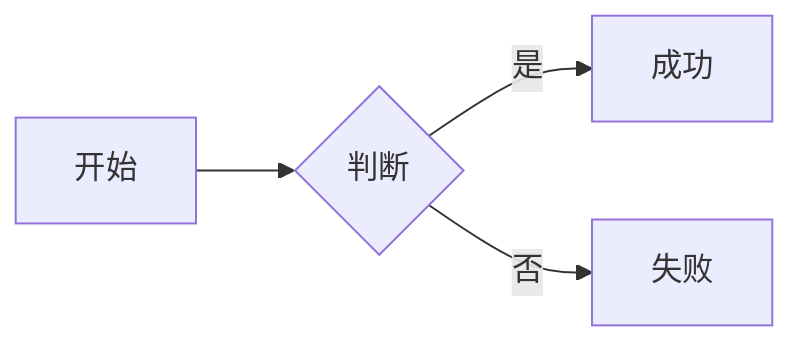
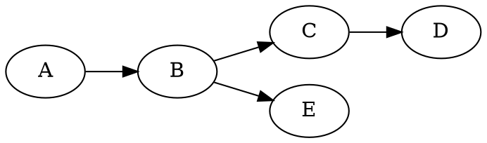

## 文档版本与修订记录

| 项 | 内容 |
|------|------|
| 文档版本 | 1.2 |
| 最后更新 | 2026-09-19 |
| 维护者 | wunai（作者）与 AI 共同维护 |
| 反馈 | 发现规范与代码不一致，请在 Giscus 评论区分反馈 |

| 版本 | 日期 | 变更 |
|------|------|------|
| 1.2 | 2026-09-19 | 新增卡组（文章组）功能与单篇文件夹写法（5.5）；重写打印章节（页眉页脚改由 `@page` 页边距盒控制，表格改回真表格避免裁切，代码块允许跨页，修长公式溢出）；顶栏重做为「品牌 / 友链 / 图片」三块并引入 `--header-h`；首页改为三屏吸附布局；页脚新增社交图标与语言/设置入口；Service Worker 不再缓存非成功响应（修图片永久不显示）；正文图片加载失败改为显示占位块。并把修订记录移至文首 |
| 1.1 | 2026-09-12 | 修正 27 处失效的本地绝对路径链接；重写 8.7 打印章节（按钮名与行为对齐代码）；补充部署两条管线与 Cloudflare 根目录坑点（4.3 / 8.2）；新增首页与页脚的关键文件解读；标注 `pinnedDescription` 未渲染、`unist-util-visit` 未使用；目录树补齐 `links/` 与 `lib/links.ts` |
| 1.0 | 2026-09-09 | 初版 |

---

本文档是 **wunai's blog** 项目的「单一信息源（Single Source of Truth）」。

**读者对象**：

- **作者本人**：写新文章前查阅 Frontmatter 字段、 shortcode 语法、常见坑点。
- **AI 助手**：被指派写文章/改文章/扩展功能时，先读完本文档再动手，避免破坏既有约定。

**阅读顺序建议**：先读「一、项目概述」「二、技术栈」「三、目录结构」建立全局观，再按需查阅「五、写作规范」「六、扩展能力清单」「七、AI 写作硬性约束」。

---

## 一、项目概述

**站点名**：wunai's blog  
**站点 URL**：https://blog.wunai.top  
**站点定位**：学习笔记与生活思考（数学、物理、化学、医学、技术）。  
**部署平台**：Cloudflare Pages（静态导出，`output: "export"`）。  
**默认语言**：中文（`zh`），同时支持英文（`en`），URL 前缀区分：`/zh/...` 与 `/en/...`。

**核心特点**：

1. **纯静态**：构建期把所有 Markdown 渲染成 HTML，部署到 CDN，访问极快。
2. **Markdown 驱动**：文章以 `.md` 文件存放在 `content/<lang>/posts/` 下，不依赖数据库。
3. **扩展能力丰富**：内置 KaTeX 数学、mhchem 化学式、SmilesDrawer 分子结构、Mermaid/ECharts/Graphviz 图表、abc.js 五线谱、自定义 shortcode。
4. **i18n 双语**：每篇文章可同时存在 `zh` 和 `en` 两个版本，URL 互不干扰。
5. **AI 友好**：`author = "AI"` 时自动加红色警示徽章，首页卡片变蓝，让读者一眼识别 AI 生成内容。
6. **可打印**：任意文章页 `Ctrl+P` 可直接导出 PDF，自动隐藏导航/目录/评论，单栏布局，暗色主题回白底。
7. **PWA**：内置 Service Worker，可离线访问已缓存页面，可安装到桌面。
8. **三态主题 + 亚克力材质**：深色 / 浅色 / 跟随系统可切；正文阅读面、文章卡片、上下篇、页脚均为半透底 + 毛玻璃（详见 3.2「界面与视觉约定」）。
9. **可互动点网格背景**：Canvas 铺满视口的点阵，光标/触点经过时点被推开、连线被拉斜，指针离开后弹簧回弹；暗色下自动降低亮度，静止时自动停帧省电。
10. **首页 = 一屏「关于」+ 最近更新 + 三篇展示**：`about: true` 的文章正文作为首屏（底部渐隐 + 「继续阅读」），中间是最近 5 次提交，下方是滚动到位渐入的展示位。
11. **设置页**：配色方案（预设 + 取色器）、阅读宽度、背景动效、亚克力开关、动画强度，全部只存本机。
12. **友链页 + 页脚联系方式**：友链卡片列表（图片/名称/介绍），页脚展示邮箱、GitHub、仓库、哔哩哔哩、YouTube、微信、Discord（图标为本地打包，国内可正常显示）。
13. **浮动导航**：左侧目录面板、右侧可拖拽的阅读进度滑块（章节圆点）、回到顶部，均不占布局宽度。

---

## 二、技术栈

### 2.1 框架与运行时

| 类别 | 选型 | 版本 | 用途 |
|------|------|------|------|
| 框架 | Next.js | 16.3.1 | App Router、静态导出、SSG |
| UI 库 | React | 19.2.8 | 组件渲染 |
| 语言 | TypeScript | ^5 | 全站类型安全 |
| 样式 | Tailwind CSS | ^4 | 工具类（PostCSS 插件） |
| 包管理 | npm | - | `package-lock.json` 锁版本 |
| 运行时 | Node.js | ≥ 20.9 | Next.js 16 的最低要求；CI 使用 20 |

> 构建器：Next.js 16 默认使用 **Turbopack**，`next build` 不再跑 ESLint（但**仍会跑 TypeScript 类型检查**，类型错误会直接令构建失败）。

### 2.2 Markdown 处理（unified 生态）

| 包 | 版本 | 作用 |
|------|------|------|
| `unified` | ^11.0.5 | 流式处理管道总入口 |
| `remark-parse` | ^11 | Markdown → mdast |
| `remark-gfm` | ^4.0.1 | GFM 扩展（表格、删除线、任务列表、脚注） |
| `remark-math` | ^6 | 数学公式 `$...$` / `$$...$$` |
| `remark-breaks` | ^4.0.0 | 软换行强制成 `<br>` |
| `remark-rehype` | ^11.1.2 | mdast → hast |
| `rehype-raw` | ^7.0.0 | 保留原始 HTML（shortcode 输出的 `<span>`） |
| `rehype-highlight` | ^7.0.2 | highlight.js 代码高亮 |
| `rehype-katex` | ^7.0.1 | 数学公式渲染（基于 KaTeX） |
| `rehype-slug` | ^6.0.0 | 给标题加 `id` |
| `rehype-autolink-headings` | ^7.1.0 | 标题自动包裹锚点链接 |
| `rehype-stringify` | ^10.0.1 | hast → HTML 字符串 |
| `unist-util-visit` | ^5.1.0 | 依赖已声明但当前未使用：`lib/markdown.ts` 用自带的 `walk` 遍历 |
| `katex` | ^0.16.0 | 数学渲染核心 |
| `katex/contrib/mhchem` | - | `\ce{}` 化学方程式语法扩展 |

### 2.3 内容与辅助

| 包 | 版本 | 作用 |
|------|------|------|
| `gray-matter` | ^4.0.3 | 解析 YAML frontmatter（TOML 由 `lib/content.ts` 自实现解析） |
| `fuse.js` | ^7.5.0 | 客户端模糊搜索 |
| `@iconify/react` | ^6.0.2 | 图标组件 |
| `@iconify/icons-mdi` | ^1.2.48 | Material Design Icons 图标集 |

### 2.4 客户端 CDN 资源（运行时按需加载）

| 资源 | CDN | 加载时机 |
|------|-----|---------|
| KaTeX CSS | jsdelivr 0.16.47 | 全局（layout.tsx `<link>`） |
| highlight.js 主题（monokai） | jsdelivr 11.9.0 | 全局（layout.tsx `<link>`） |
| Mermaid | jsdelivr 10 | 文章含 `.mermaid` 时 |
| ECharts | jsdelivr 5 | 文章含 `.echarts` 时 |
| viz.js（Graphviz） | jsdelivr 3 | 文章含 `.graphviz` 时 |
| abc.js（乐谱） | jsdelivr 6.7.0 | 文章含 `.abc` 时 |
| SmilesDrawer | jsdelivr 2.4.1 | 文章含 `.chem` 时 |
| Giscus 评论 | giscus.app | 滚动到评论区时懒加载 |

### 2.5 工程化

| 工具 | 配置文件 | 作用 |
|------|---------|------|
| ESLint + eslint-config-next | `eslint.config.mjs` | 代码风格 |
| PostCSS + @tailwindcss/postcss | `postcss.config.mjs` | Tailwind v4 编译 |
| TypeScript | `tsconfig.json` | 类型检查（`strict: true`，路径别名 `@/*`） |
| Cloudflare Pages | `wrangler.toml` | 部署配置（`pages_build_output_dir = "out"`） |

---

## 三、目录结构（每个文件的作用）

下面是项目根目录 `my-app/` 的完整树形结构，每个文件都标注作用。

```
my-app/
├── app/                         # Next.js App Router 路由层
│   ├── layout.tsx               # 根布局：HTML 骨架、全局 SVG 滤镜定义、KaTeX/highlight.js CDN、Service Worker 注册、RouteLoading
│   ├── page.tsx                 # 根路径 "/" → 重定向到 /zh/
│   ├── globals.css              # 全站 CSS 变量、布局、组件样式、打印样式、动画
│   ├── not-found.tsx            # 全局 404 页
│   ├── robots.ts                # /robots.txt 生成（allow: /，sitemap 指向）
│   ├── sitemap.ts                # /sitemap.xml 生成（首页、列表页、所有文章）
│   ├── favicon.ico              # 站点图标
│   └── [lang]/                  # 动态路由：语言前缀 zh / en
│       ├── layout.tsx           # 语言层布局：Header + main + Footer
│       ├── page.tsx             # 首页：一屏「关于」正文 + 最近 5 次更新 + 向下滑动图标 + 展示位
│       ├── archives/
│       │   └── page.tsx         # 归档页：按年分组列出文章
│       ├── categories/
│       │   ├── page.tsx         # 分类云
│       │   └── [category]/
│       │       └── page.tsx     # 单个分类下的文章列表
│       ├── links/
│       │   └── page.tsx         # 友链页：介绍 + 友链卡片列表（数据在 lib/links.ts）
│       ├── settings/
│       │   └── page.tsx         # 设置页：配色 / 宽度 / 背景 / 亚克力 / 动画
│       ├── posts/
│       │   ├── page.tsx         # 文章列表页
│       │   └── [slug]/
│       │       └── page.tsx     # 文章详情页：面包屑、标题、meta、TOC、正文、上下篇、评论、JSON-LD
│       ├── search/
│       │   └── page.tsx         # 搜索页：挂载 <Search> 组件
│       └── tags/
│           ├── page.tsx         # 标签云
│           └── [tag]/
│               └── page.tsx     # 单个标签下的文章列表
│
├── components/                  # React 组件（共 18 个）
│   ├── Header.tsx               # 顶栏：品牌区（主题切换 + 大号 logo + 小字行）+ 友链 + 图片区
│   ├── HeaderIntro.tsx          # 顶栏入场：级联淡入（渐进增强）+ 光标切后台暂停
│   ├── Footer.tsx               # 页脚：欢迎语 + 联系方式/社交/设置/语言卡片 + 「感谢你的阅读」 + 版权行
│   ├── PostCard.tsx             # 文章卡片：3D 鼠标跟踪倾斜 + 亚克力材质 + AI 蓝色变体
│   ├── GroupCard.tsx            # 卡组卡片：背后两层堆叠 + 跟随指针的光斑 + 封面填满边框
│   ├── PageIndicator.tsx        # 首页右侧分页指示点（高亮当前屏 + 点击跳页）
│   ├── PostBody.tsx             # 正文容器：客户端渲染 mermaid/echarts/graphviz/abc/smiles-drawer/代码复制；图片失败占位；长公式缩放
│   ├── PostNav.tsx              # 浮动导航：sticky 章节标题 + TOC 面板 + 阅读进度滑块 + 章节圆点 + 回到顶部
│   ├── InteractiveBackground.tsx # 可互动点网格背景（Canvas：指针推力 + 弹簧回弹，暗色降亮度，静止停帧）
│   ├── ScrollReveal.tsx         # 滚动到位渐入容器（IntersectionObserver，无 JS 时有 noscript 兜底）；首页已不再使用但保留
│   ├── SiteSettings.tsx         # 设置页客户端组件：读写 localStorage 并同步到 <html> 的 data-* 属性
│   ├── Comments.tsx             # Giscus 评论（滚动到视口才加载，明暗自适应）
│   ├── PrintControls.tsx        # 文章页按钮：「打印」（window.print）+ 「下载 MD」；并把打印页眉页脚文本注入 CSS 变量
│   ├── Search.tsx               # Fuse.js 客户端搜索（拉取 /search-index.<lang>.json）
│   ├── ThemeToggle.tsx          # 主题切换：light / dark / auto（localStorage 持久化）
│   ├── FontSizeControl.tsx      # 字号控制：85%–130% 七档（localStorage 持久化）；当前未挂在顶栏
│   ├── LangSwitcher.tsx         # 语言切换：/zh/xxx ↔ /en/xxx（渲染为页脚卡片）
│   └── RouteLoading.tsx         # 路由切换 Loading 动画（竖向贴右、镂空文字、进度条、闪光、拖尾）
│
├── lib/                         # 业务逻辑层（无 React，纯 TS）
│   ├── site.ts                  # 站点配置：标题/作者/URL/菜单（含图标）/i18n 文案/联系方式/类型定义
│   ├── content.ts               # 内容读取：frontmatter 解析、平铺/单篇文件夹/卡组三种扫描、排序与筛选、归档、首页展示位
│   ├── links.ts                 # 友链数据：名称/地址/图片/中英介绍
│   ├── settings.ts              # 设置项定义、localStorage 键名、自定义主色的明度换算
│   ├── markdown.ts              # Markdown 渲染：unified 管道、自定义 shortcode/CJK 优化/XSS 过滤/TOC 提取
│   └── icons.ts                 # Iconify 图标集中导入（白名单，新图标必须登记）
│
├── content/                     # Markdown 内容源
│   ├── zh/
│   │   ├── archives.md           # （占位，归档页由路由生成，不需要）
│   │   ├── search.md             # （占位）
│   │   └── posts/
│   │       ├── _index.md         # 列表页占位（空文件即可）
│   │       ├── 你好世界.md        # 首页「关于」文章（about: true + pinned: true）
│   │       ├── 博客.md
│   │       ├── 写作模板.md         # 旧版写作速查（draft: true，保留作历史参考）
│   │       ├── markdown基础语法.md
│   │       ├── markdown-功能综合演示.md
│   │       ├── 希腊字符.md
│   │       ├── 国际基本单位换算.md
│   │       ├── 抗生素发展史.md
│   │       ├── 奎宁.md
│   │       ├── 离轴全息奠基性论文的硬核解读.md
│   │       └── 博客书写规范.md     # ← 本文
│   └── en/
│       ├── archives.md
│       ├── search.md
│       └── posts/
│           ├── _index.md
│           ├── hello-world.md
│           ├── math-chem-code-demo.md
│           └── turing-machine.md
│
│ 注：中文站有「关于」文章（`about: true`），英文站没有，因此英文首页首屏回退为 SITE.homeInfo 的简介。
│
├── public/                      # 静态资源（构建时原样拷贝到 out/）
│   ├── manifest.webmanifest     # PWA manifest
│   ├── sw.js                    # Service Worker：预缓存首页、SWR 页面、cache-first 静态、network-first CDN
│   ├── offline.html             # 离线兜底页
│   ├── rss.xml                  # RSS feed（构建时由 scripts/generate-rss.mjs 生成）
│   ├── changelog.json           # 最近 5 次更新（构建时由 scripts/generate-changelog.mjs 生成，首页用）
│   ├── search-index.zh.json     # 中文搜索索引（构建时由 scripts/generate-search-index.mjs 生成）
│   ├── search-index.en.json     # 英文搜索索引
│   ├── file.svg / globe.svg / next.svg / vercel.svg / window.svg  # 占位图（可删）
│
├── scripts/                     # 构建前置脚本
│   ├── generate-search-index.mjs  # 扫描 content/，生成 search-index.<lang>.json
│   ├── generate-rss.mjs           # 扫描 content/，生成 rss.xml（取最新 20 篇）
│   └── generate-changelog.mjs     # 取最近 5 次提交，生成 changelog.json（首页「最近更新」用）
│
├── out/                         # 构建产物（next build 输出，部署到 Cloudflare Pages 的目录）
│
├── next.config.ts               # Next.js 配置：output="export"、images.unoptimized、trailingSlash
├── tsconfig.json                # TypeScript 配置
├── postcss.config.mjs           # PostCSS 配置（Tailwind v4）
├── eslint.config.mjs            # ESLint 配置
├── wrangler.toml                # Cloudflare Pages 部署配置
├── package.json                 # 依赖与脚本（prebuild 跑两个生成脚本）
├── package-lock.json            # 版本锁
├── .gitignore
├── AGENTS.md                    # Next.js agent 规则 + 「工作流约定」（改代码前先 git pull）
├── CLAUDE.md                    # 指向 AGENTS.md
└── README.md                    # 项目文档：特性、写作指南、部署与排错
```

仓库根目录（`my-app/` 之外）还有两件东西，本文档同样适用于它们：

```
wunai-blog/
├── my-app/                      # Next.js 应用（上文展开）
├── .github/workflows/deploy.yml # GitHub Actions：npm ci → npm run build → wrangler pages deploy out
└── README.md                    # 项目级说明（与 my-app/README.md 分工：前者面向贡献者，后者是应用入口）
```

### 3.1 关键文件解读

#### `lib/site.ts` — 站点单一配置点

所有「站点级常量」集中在此：标题、作者、URL、菜单、i18n 文案、**页脚联系方式 `contact`**、`PostFrontmatter` / `Post` 类型定义。**改站点信息只改这一个文件**。

#### `lib/content.ts` — 内容读取与查询

- 自实现简易 TOML 解析（`+++ ... +++`），同时支持 `gray-matter` 的 YAML。
- 日期规范化：YAML 解析出的 `Date` 对象统一转 `YYYY-MM-DD` 字符串，避免时区错乱。
- 字数统计：中文按字、英文按 word，求和。
- 文章排序：**非 AI 在前 + 按 date 降序**，**AI 在后 + 按 date 降序**。这意味着 AI 文章永远排在人工文章下面。
- 缓存：`_cache` 对象按 lang 缓存，避免重复读盘。
- 取数辅助函数：`getPosts` / `getPost` / `getPinnedPosts` / `getPrevNext` / `getArchives` / `getAllTags` / `getPostsByTag` 等；首页相关两个：
  - `getHomeShowcase(lang, limit = 3)` —— 展示位取数：有置顶取置顶，否则取最新非 AI 文章；两者都排除 `about` 与 `hiddenInHomeList`。
  - `getAboutPost(lang)` —— 取 `about: true` 的文章（首页首屏用）。

#### `lib/links.ts` — 友链数据

`FRIEND_LINKS` 数组，每项 `{ name, url, avatar?, description? }`；`friendText()` 按当前语言取介绍（无介绍时由页面回退显示域名，见 `friendHost()`）。友链页在 `app/[lang]/links/page.tsx`，菜单入口在 `SITE.menu`。**新增/更换友链只改这个文件**。

头像优先级：对方 GitHub 头像直链 → 其站点自己的头像图或 favicon → `public/avatars/` 下的本地图。**每次新增都要先实测该 URL 确实返回图片**（有的站点 `/favicon.ico` 实际返回 HTML 页），否则会碎图。

#### `lib/markdown.ts` — Markdown 渲染管道

`renderMarkdown(post)` 返回 HTML 字符串。管道顺序（**顺序很重要，不能乱**）：

1. `remarkParse` — 解析 Markdown
2. `remarkGfm` — GFM 扩展
3. `remarkMath` — 识别 `$...$` 数学语法
4. `remarkBreaks` — 软换行变 `<br>`
5. `remarkCustomShortcodes` — **自定义插件**：处理 `==高亮==`、`[reference:N]`、``、``、``
6. `remarkRehype` — 转 hast（`allowDangerousHtml: true` 让 shortcode 输出的 HTML 留下来）
7. `rehypeRaw` — 把混入的原始 HTML 字符串解析成 hast 节点
8. `rehypeDiagramBlocks` — **自定义插件**：把 ` ```mermaid ` 等代码块转成 `<div class="mermaid">`
9. `rehypeHighlight` — 代码高亮
10. `rehypeKatex` — 数学渲染（注入自定义宏 `\RR \CC \ZZ \NN \QQ \dd`）
11. `rehypeSlug` — 标题加 id
12. `rehypeAutolinkHeadings` — 标题包裹锚点
13. `rehypeImages(post)` — **自定义插件**：图片懒加载、相对路径转绝对
14. `rehypeXssFilter` — **自定义插件**：拦截 `javascript:` / `vbscript:` / `data:` 协议
15. `rehypeCjkOpt` — **自定义插件**：CJK 与 ASCII 间加空格、中文标点转换（**跳过 KaTeX 内部文本**）
16. `rehypeStringify` — 输出 HTML

#### `components/PostBody.tsx` — 客户端渲染中枢

服务端把 HTML 字符串塞进 `<div dangerouslySetInnerHTML>`，客户端 `useEffect` 扫描 DOM：

- `pre` → 加「Copy」按钮
- `.mermaid` → 加载 mermaid.js 并 `run()`
- `.echarts` → 加载 echarts 并 `init()` + `ResizeObserver`
- `.chem` → 加载 smiles-drawer，`parse()` 异步回调里 `drawer.draw(tree, canvasId, "light")`
- `.graphviz` → 加载 viz.js，`await Viz.instance()` 后 `renderSVGElement()`
- `.abc` → 加载 abcjs，`renderAbc()`

**所有第三方库都用 `loadScript` 动态注入，且用 `window.xxxLoaded` 标志位防重复加载**。

#### `app/[lang]/posts/[slug]/page.tsx` — 文章详情页

职责：

- 调 `getPost` / `renderMarkdown` / `extractToc` / `getPrevNext`
- **单栏布局**：正文居中（`.post-layout` 最大宽 800px），左侧「全部文章」栏已移除；目录 / 进度滑块 / 回到顶部由 `PostNav` 以浮动形式提供，不占布局宽度
- meta 信息行：日期、阅读时间（`wordCount/400`）、字数、作者徽章
- 标签链接
- 页头按钮：「打印」（`t.printSingle` → `window.print()`）与「下载 MD」（前端用 `buildFullMarkdown()` 重建含 frontmatter 的原文后 Blob 下载）
- JSON-LD 结构化数据（`BlogPosting` schema，利于 SEO）
- 上下篇导航 + Giscus 评论区

> 打印页眉页脚已移除（早期版本存在 `print-header` / `print-footer`，现已从 DOM 中删除，打印样式里只保留隐藏它们的兼容规则）。

#### `components/PostCard.tsx` — 文章卡片

除标题、日期/字数/作者、摘要外，右侧会展示该文的缩略图（若有）。取图优先级：

1. frontmatter 的 `cover.image`
2. 正文第一张图（所以已有文章不补封面也有图）
3. 都没有 → 不渲染图片

三个实现细节：

- 取图在**构建期**完成（`lib/content.ts` 的 `pickThumbnail()` → `post.thumbnail`），客户端不扫 DOM。路径规则与 `rehypeImages` 一致：绝对 URL / 站内绝对路径直接用，相对路径补成 `/<lang>/posts/<slug>/<src>`。
- **提取前必须剥掉围栏代码块与行内代码**。否则文档里的示例会被当真图：行内示例如 `` `` ``；围栏示例如用**四反引号**包裹的 ```markdown 代码块。**剥法要按行处理、闭合符需字符相同且长度不短于开启符** —— 用正则去找三反引号会因“四反引号包含三反引号”而配对错位，把代码块内的图片漏出来当缩略图（《博客书写规范》就曾因此挂上一个碎图）。
- 缩略图可能是外链，对方可能禁外链 → `` 时隐藏整个缩略图，不留碎图占位。

布局用一个 flex：正文包在 `.post-card-body`（**必须 `min-width: 0`**，否则长标题会把缩略图挤出容器），缩略图是 `.post-card-thumb`（`flex: 0 0 33%`，即占卡片内容宽度的右 1/3，文字占剩下的 2/3）。无缩略图时 `.post-card:not(.has-thumb)` 退回纵向排版。

三个容易写错的地方：

- **不要给缩略图写 `aspect-ratio`**，也要把卡片的 `align-items` 设为 `stretch`。高度必须由**文字那一侧**决定、缩略图跟着撑满；若用宽高比定高，文字比图高时右侧会空出一块。
- **缩略图内的 `img` 用 `position: absolute; inset: 0`**，而不是 `height: 100%`。百分比高度依赖父级的确定高度，在 flex 拉伸场景下不够可靠；`inset: 0` 一定生效，配 `object-fit: cover` 正好“填满并裁切”。
- 图片整体落在卡片内边距以内（距边缘 20/24px），而角标线框是内缩 5px 的，所以图始终在**线框里面**，不会压到框线。

#### `components/InteractiveBackground.tsx` — 可互动点网格背景

- 挂在根布局 `<body>` 最前面，CSS 为 `.bg-canvas { position: fixed; z-index: -1; pointer-events: none }`，因此不拦截任何点击/选中。
- 网格点坐标/偏移/速度存在一个 `Float32Array` 里；指针（或触点）影响力半径内的点被推开，离开后由弹簧回弹。
- 位移分 4 档决定点的尺寸与透明度，并从前景色过渡到强调色；相邻点之间画 0.6px 细线（按位移分 2 档批量 `stroke`）。
- 暗色下乘一个亮度系数（`alphaScale`）压低亮度；**网格完全静止时停帧**，下一个指针事件才唤醒（省电）。
- 尊重 `prefers-reduced-motion`：只画一帧静态网格，不启动循环、不绑定交互。
- 可调参数全部集中在文件顶部常量区（间距、点数上限、影响半径、推力、弹簧刚度、阻尼、线宽、透明度等）。

#### `app/[lang]/page.tsx` — 首页

首页是三屏**吸附式**（scroll-snap）布局，对应三个组件块：

| 屏 | 内容 | 数据来源 |
|----|------|----------|
| 1. 首屏 | `你好，我是 wunai。` + 站点简介 + 向下提示 | i18n `heroLead` / `heroEnd` + `SITE.homeInfo` |
| 2. 更新内容 | 最近 5 次提交（日期 + 信息 + NEW 徽标，可点进 GitHub） | `getChangelog()` ← `public/changelog.json` |
| 3. 随便看看 | 交错卡片网格（分类徽标 + 标题 + 摘要 + 日期）+ 全部文章入口 | `getHomeShowcase(lang, 6)` |

没有更新数据时第 2 屏整块不渲染，指示点也相应从 3 个变成 2 个。

**吸附的实现要点**（这几条都是踩过的坑）：

1. **吸附写在 `<html>` 上，不另建 `height:100vh` 的内部滚动容器。**
   常见做法是做一个独占滚动的容器，但本站页脚（语言切换 / 设置入口）跟在首页之后，
   那样会把页脚永久挡住、读者根本够不到。
2. **用 `proximity` 而非 `mandatory`。** mandatory 在某屏内容高于视口时会把页面「卡住」，
   读者翻不到那屏的后半段，也滚不过最后一屏去够页脚。
3. **用选择器限定作用域**：`html:has(.home-pager)`。
   不限定的话，`scroll-padding-top` 会连带影响文章页的锚点跳转——
   那里已有 `.article h2 { scroll-margin-top: 80px }`，两者会叠成双重偏移。
4. **每屏高度是 `calc(100svh - var(--header-h))`**，不是 `100vh`：
   顶栏 sticky 常驻，要扣掉它；用 `svh` 而非 `vh` 是为了避开手机地址栏伸缩引起的跳动。
5. **高度用 `min-height`**：更新列表较长时允许本屏自然变高，不会被固定高度裁掉内容。
6. **`scroll-padding-top: var(--header-h)`** 让吸附位置落在顶栏下方，而不是被顶栏压住。
7. **向下提示的关键帧要带 `translateX(-50%)`**，否则动画的 `transform` 会把居中位移覆盖掉。
8. **打印时关掉吸附**（`scroll-snap-type: none`），并把交错网格改回单列顺序排列，
   否则纸上会左右错位失衡。

#### `components/PageIndicator.tsx` — 右侧分页指示点

客户端组件，负责高亮当前屏与点击跳页。判断「当前在哪一屏」用的是
**每一屏到吸附位置的垂直距离取最近**，而不是 `IntersectionObserver` 的阈值比例：
本页允许某屏高于视口（更新列表长时），阈值比例会失去意义，而「离吸附点最近」在任何高度下都成立。
吸附位置取的是 `.site-header` 的实际高度，不是写死的常量。

#### `components/Header.tsx` — 顶栏

三块：品牌区（主题切换 + 大号 logo + 闪烁光标 + 小字行）、友链、右侧图片区。

- **`About……` 指向「关于」文章本身**（`getAboutPost`），不再指回站点根路径——
  首页已不再渲染关于正文，指回去会变成点了没反应。
- **`--header-h` 是顶栏高度的唯一来源**：`.navbar` 直接用它做固定高度，
  因此该变量与实际高度必然一致。粘性标题、目录按钮、面板、首屏高度、锚点偏移全拿它定位。
  断点处只改这一个值（平板 78px / 手机 70px）。
- **主题切换要有 `align-items: center`**：`.brand` 是 grid，只写 `align-content`（管行间）
  不够，行内各项默认 `stretch`，会把 44px 的开关位与小一号的 logo 拉成不同高度。
- **友链靠右用 `margin-left: auto`**：有 auto 外边距时剩余空间先被它吃掉，
  `justify-content` 在这条轴上不再起作用，所以右靠位置是确定的。
- **入场动画（`HeaderIntro.tsx`）是渐进增强**：默认可见 → JS 就绪后加 `.fade-ready` 隐藏
  → 逐个加 `.is-visible` 播放。顺序反过来的话，JS 失败时顶栏会永久不可见。
  光标在页面切到后台时暂停闪烁。

#### `components/Footer.tsx` — 页脚

从 `SITE.contact` 与 i18n 读欢迎语与联系方式，渲染为七张亚克力卡片：邮箱（`mailto:`）、GitHub 主页、本站仓库、哔哩哔哩、YouTube（这五个可点，外链新窗口打开，显示文本自动去掉 `https://`），以及微信（纯展示 ID）与 Discord（说明文案）两张静态卡片。底部细分割线下是原有版权行（Powered by Next.js · Hosted on Cloudflare）。

三个要留意的点：

- **文案与地址分开存**：联系人地址与账号在 `SITE.contact`，而标签、说明文案、仓库名在 `i18n`（中英各一份）。曾经把 `label` / `body` / `repoLabel` 写在 `contact` 里，导致英文页也显示中文。
- **图标必须是本地打包的**：`Label` 子组件里的图标全部来自本地 `@iconify/icons-mdi`，配合 `@iconify/react/offline`，不会请求任何外部图标 CDN —— 这是“国内也能正常显示”的前提。当前用的七个名字都逐个核过存在；注：**MDI 没有 bilibili 图标**，用 `television-classic` 代替。新增图标时先去 `https://api.iconify.design/mdi/<name>.svg` 确认名字存在（404 就是没有），否则构建时会因找不到文件而失败。
- **图标动作**：默认静止，鼠标悬停卡片时跑一段 `footer-icon-pop`（上浮 + 小幅度摆）。刻意不加无限循环 —— 页脚同时有七张卡片，常驻循环既吵又耗电。静态卡片（微信/Discord）不可点，不给动作；`prefers-reduced-motion` 与 `data-motion=lite/off` 下也不跑。

#### `components/ScrollReveal.tsx` — 滚动到位渐入

通用工具：初始隐藏态写在 CSS（`.reveal`），进入视口后由 `IntersectionObserver` 加上 `.is-shown`；元素内附一段 `<noscript>` 样式兼底，**禁用 JS 时内容不会永久不可见**（静态导出站点必须注意这一点）。

首页已改为三屏吸附、不再用它（`.reveal` 的基础样式仍保留，以免以后拿去用时样式缺失）。

### 3.2 界面与视觉约定（改样式前必读）

改 `app/globals.css` 或组件样式前，先看这几条已经定下的约定，避免把现有观感弄坏：

**1. 全站直角，无圆角**

所有 `border-radius` 均为 `0`，包括圆形指示（进度圆点、目录小点、回到顶部按钮、缓存红点）。新增元素请继续用直角；只在 `.post-card::after` / `.post-content::before` 里留了 `border-radius: inherit`，为以后改回圆角留口子。

**2. 亚克力材质（半透底 + 毛玻璃）**

材质参数统一在两组 CSS 自定义属性里，亮/暗各一套，随 `html.dark` 切换：

| 令牌 | 用途 | 浅色 | 暗色 |
|------|------|------|------|
| `--reading-*` | 正文阅读面（`.post-content`）；页脚借用它的颜色与模糊 | `rgba(255,255,255,0.965)`，模糊 14px | `rgba(44,44,51,0.68)`，模糊 22px |
| `--card-acrylic-*` | 文章卡片、上下篇、友链卡片、页脚按钮 | `rgba(255,255,255,0.82)`，模糊 10px | `rgba(54,54,62,0.62)`，模糊 16px |

**浅色靠不透明，暗色靠抬亮的玻璃色**：浅色下正文是深色文字，背底亮点穿透字形会干扰阅读，所以阅读面接近不透明；暗色下如果沿用“与底色接近的暗色”，面板和页面几乎同色、根本看不出是块“面”，所以改成“抬亮的玻璃色 + 更大的模糊”。

**阅读面的毛玻璃只在 ≥1024px 启用，窄屏走无模糊快路径**：

- `backdrop-filter` 会为元素的**整个高度**分配一张模糊层。正文阅读面可以长到上万像素，一张约 800×10000px 的图层就吃掉 ≈31MB 显存；手机上很容易把合成器压垮，症状正是“**文章页很长时间打不开**”（只有文章页有 `.post-content`，所以只有它慢）。
- 而阅读面本身不透明度很高（浅色 0.965），模糊的视觉贡献本来就极小 —— 关掉它几乎看不出差别。
- 窄屏没了模糊兜底，暗色的 `--reading-bg` 要在 `@media (max-width: 1023px)` 里提到 0.88，否则背底的点会从字形后面透出来。
- **同理，`.post-content` 不参与四角角标**：那个 `::after` 也是满尺寸图层，且“四角相连”在文档级高的面板上本来就不成立。

**暗色下不要白色渐变**：`--reading-sheen` / `--card-acrylic-sheen`（顶部白光泽）与 `--reading-inner-glow` / `--card-acrylic-glow`（白色内高光）在暗色里都取全透明值，并在暗色下把 `.post-content::before` 直接 `display: none`。写成全透明而不是 `none`，是因为它们在 CSS 里是逗号列表的一项（`background: sheen, bg` / `box-shadow: shadow, glow`），写成 `none` 会让整条声明失效。卡片背后原先那层白色发光雾团（`--fog-*`）也已删除。

两条硬约束：

- **`backdrop-filter` 不能和 `transform` 加在同一元素上**（分组属性会被强制扁平化）。所以卡片的亚克力层放在 `::after` 伪元素里，而卡片本身由 JS 写行内 `transform` 做 3D 倾斜；正文阅读面则把入场动画放在内层 `.article` 上。
- **底色必须留给亚克力层**：元素自身保持 `background: transparent`，否则 `backdrop-filter` 会把元素自己的底当背景模糊，透不出后面的点网格。内容需 `position: relative; z-index: 1` 压在材质层之上。

**2.1 角标：内缩矩形框 + 对角两枚十字**

带边框的**面板**，在其内侧 5px 处画一个矩形框（四条边连起来），并只在**左上、右下两角**额外画十字；右上与左下只是框线的拐角。线条从交点向外渐变到**接近底色的终点色**，所以读起来像“从交点延伸出去的直线”。

**颜色分主题**

| 主题 | 交点色 `--cn-color` | 终点色 `--cn-end` | 效果 |
|------|------|------|------|
| 亮色 | `#2563eb` 蓝 | `#ffffff` 白 | 蓝 → 白（白即卡片底色，看起来就是淡出） |
| 暗色 | `#7f1d1d` 暗红 | `#000000` 黑 | 暗红 → 黑（黑接近页面底色，同样是淡出） |

**颜色分布：全图只有两个交点是满色**

- 十字的 4 条臂：`--cn-h / --cn-v`，终点色 → 交点色 → 终点色
- 框的 4 条边：`--cn-e-tl-r / --cn-e-tl-d`（上边与左边，从左上交点向右/向下）、`--cn-e-br-l / --cn-e-br-u`（下边与右边，从右下交点向左/向上），各自是从交点色到终点色的单向渐变

> 关键：**不能有恒定色段**。早先写成“两端淡出、中间固定色”，边线中段一直是满色，就不是“只有交点最深”了；上面四组单向渐变才是正确做法。

**颜色 token**：两个都定义在 `:root` 并在 `html.dark` 里覆盖 —— `--cn-color`（交点色）亮色 `#2563eb` / 暗色 `#7f1d1d`，`--cn-end`（终点色）亮色 `#ffffff` / 暗色 `#000000`。伪元素规则里只引用变量，所以换配色只改这两个 token。

**关于“线段 / 射线 / 直线”**

CSS 只能画有界的色块，因此画出来的一律是**线段**（两端点）；真正的**直线**（两端无限）与**射线**（一端无限）无法表达。让线段读起来像直线的手段就是**端点渐变到与底色接近的颜色** —— 渐变暗示线还在继续（所以十字的臂两端都渐变到终点色，看起来像一条穿过交点的无限长线）。

**覆盖范围**

| 元素 |
|------|
| `.post-card`、`.post-nav a`、`.friend-card`、`.update-item`、`.home-card`、`.collection-card`、`.toc-panel`、`.settings-panel` |

**`.post-content`（正文阅读面）不在名单里**：框的长度是 `100% - inset × 2`，在高达上万像素的文章上会变成四条贯穿全文的线 —— “四角相连”在文档级高的面板上本来就不成立；更实际的问题是这个满尺寸 `::after` 会独立成一层，与 `backdrop-filter` 一起把显存吃掉几十 MB（手机上表现为文章页打不开）。

**不加角标的元素及原因**

- **小元件**（`.pagination`、`.term-item`、`.tag`、`.author-badge`、`.print-btn`、`.footer-link`、`.back-to-top`、`.toc-fab`）：它们数量多、叠上去显得吵；而且 20px 高的标签本就塞不下 5px 内缩的框，需要另调一套数值。已明确不要。
- `.search-box`：它是 `<input>`，**伪元素在表单控件上不会渲染**（除非设 `appearance: none`，不值得为装饰改动控件外观）
- `.friend-avatar`：图片/48px 方块，太小且是图形
- `.article pre`（代码块）、`.article table`、`html.dark .katex-display`：自身 `overflow-x: auto` 会**横向滚动**，绝对定位的伪元素会跟着滚走；且代码块右上角已被 Copy 按钮占用
- `.collection-card .stack`：它是卡片背后的装饰堆叠层，不是内容面板

**实现要点**

- 一个伪元素叠 **8 层 `background`**（4 条框边 + 4 条十字臂）画完，不增加任何 DOM。
- **四组单向/对称渐变，没有任何恒定色段**：`--cn-h / --cn-v`（十字臂，终点色→交点色→终点色）、`--cn-e-tl-* / --cn-e-br-*`（框边，各从交点角单向渐变到终点色）；另有 `--cn-solid` 备用，想要无渐变的实线时可用。
- **不能用 `border` 代替背景层**：伪元素必须保持 `inset: 0`，否则 `background-clip: border-box` 会裁掉十字伸出框外的部分。
- 框边长度 = `--cn-span`（`100% - inset × 2`）；下、右两条的定位再减掉一个线宽，保证框完整落在 `[inset, 100%-inset]` 区间内。
- **十字定位**：以框角为中心，横臂 `x = inset - arm`、竖臂 `y = inset - arm`，右侧/下侧用 `calc(100% - …)` 镜像；垂直方向都减 `w/2` 做居中对齐。
- **颜色** `--cn-color`（交点）：亮色 `#2563eb` 蓝 / 暗色 `#7f1d1d` 暗红；`--cn-end`（终点）：亮色 `#ffffff` 白 / 暗色 `#000000` 黑。两者都在 `html.dark` 里覆盖，没有写进伪元素规则，所以换配色只改这两个 token。
- **尺寸分级已取消**：不再给小元件加角标，所以 `--cn-inset` / `--cn-arm` 只有面板一套数值（5px / 3.5px）。
- **伪元素分配**：`.post-card` 的 `::after` 已被亚克力层占用，所以它用 `::before`；其余均用 `::after`。
- **层级**：`z-index: 1`。亚克力/光泽伪元素是 `z-index: 0` 且晚于 `::before` 绘制，不提升会被半透底盖淡；内容也是 `z-index: 1` 但晚于伪元素，文字仍在角标之上。
- 打印时全部 `display: none`（装饰，省墨）。

调参：`--cn-color`（交点色）/ `--cn-end`（终点色）/ `--cn-inset`（内缩）/ `--cn-arm`（臂长）/ `--cn-w`（线宽），整体浓度改伪元素上的 `opacity`（默认 0.6）。

**2.2 站点标题的差异混合**

以下标题写 **纯白字 + `mix-blend-mode: difference`**，靠 `|背景 − 文字|` 在两个主题下自动反色：浅色底得到近黑、暗色底得到近白。

- 参与：`.hero-title`、`.page-title`、`.archive-year`、`.not-found h1`
- 不参与：`.post-header h1`（文章页大标题）、`.home-card-title` / `.section-title`
  （它们所在的首页卡片会脱离混合组上下文，参与反而会发白）

四条必须知道的约束（不满足的宁可不加）：

- **文字必须是纯白**。若照直觉写成 `--fg`（近黑）再混合，白底上会算出 `rgb(232,228,228)`，与背景对比度约 1.15:1 —— 基本看不见，方向是反的。
- **祖先不能有 `backdrop-filter` / `filter` / `transform` / `opacity<1` / `mask`**。这类属性会把祖先变成 **backdrop root**，而 backdrop root 内部的“背底”退化为 **透明**，difference 于是算出原色（白）—— 白字在白底上直接消失，亮色模式下必然复现。
  - 文章页大标题 `.post-header h1` 就属于这种情况：祖先是带 `backdrop-filter` 的 `.post-content`（正文亚克力阅读面），所以它继承 `--fg`，**不参与混合**。这也意味着“亚克力面板里的标题”与“差异混合”本质上不兼容，别再往名单里加回去。
- **带渐入动画的容器内的标题不能参与**：`.reveal` 在动画期间有 `transform` 与 `opacity < 1`，同样是 backdrop root，标题会先以白色淡入、动画结束才突变成黑。若以后要把某个标题放进 `ScrollReveal`，记得同步从名单里移除。
- **逐个点名，不要写 `main :is(h1, h2)`**：列表页的文章卡片 `.post-card h2` 也是 h2，而它的 `<a>` 自带 `color: var(--fg)`（近黑）；父级一旦建立混合组，里面的字会被混成接近背景的颜色而消失。新增标题时请显式加入名单。

另外两条工程细节：

- 整段包在 `@supports (mix-blend-mode: difference)` 里。万一浏览器不支持，`color: #fff` 会变成“白字白底”，比不生效更糟。
- **代价**：混合会强制独立合成层，浏览器会关掉次像素抗锯齿，文字改用灰度抗锯齿，浅色底上略显发虚。这是技术固有成本，不是能优化的。

打印时统一恢复 `mix-blend-mode: normal` + 黑字（差异混合在 PDF 里可能被光栅化或失效），名单与上面一致。

**3. 背景层**

- `.bg-canvas`（点网格，`InteractiveBackground`）：明暗主题都启用。
- 未来若要再加背景层：负 `z-index` + `pointer-events: none`，并在 `@media print` 里隐藏。

**4. 主题与首屏无闪烁**

主题（light / dark / auto）存在 `localStorage`，在 `<head>` 内联脚本里完成引导（避免 FOUC）；组件里靠 `MutationObserver` 监听 `html` 的 `class` 变化来重新读色。

**5. 打印降级**

`@media print` 里必须把两类东西清干净：亚克力（`background: none`、`backdrop-filter: none`、`position/z-index` 归零）与动画（`animation: none`）；首页还需取消正文裁切并隐藏「继续阅读」与向下滑图标。

**5.1 移动端后台省电**

三条约定，新增带动画/合成层的元素时要一并考虑：

- `app/layout.tsx` 的内联脚本会在后台给 `<html>` 打 `data-page-hidden`，CSS 统一 `animation-play-state: paused`。**新增无限动画无需自己处理后台暂停**，会自动被覆盖。
- **不要写常驻 `will-change`**：全站有多个 `backdrop-filter` 图层，常驻提升会让显存成倍增长；只在真需要时（如 `:hover`）临时提升。
- `InteractiveBackground` 在 `visibilitychange` + `pagehide` 时停帧，`pageshow` / 回到前台恢复；`stop()` 必须同时置 `idle = true`，否则 `wake()` 不会重启循环。

**6. 图标是白名单**

图标全部从 `lib/icons.ts` 显式 import 并登记。**新增图标必须先在那里登记**，否则 TypeScript 报 `TS7053`，构建直接失败（`next build` 会跑类型检查）。

**7. 工作流约定**

改代码前先 `git pull`（见 `my-app/AGENTS.md`），提交信息用中文、一次改动一个主题。

---

## 四、写作流程

### 4.1 新建文章

1. 在 `content/zh/posts/` 下新建 `.md` 文件（文件名建议中文，会作为 URL slug）。
2. 复制下方「五、Frontmatter 规范」的模板填头。
3. 写正文。
4. `draft = true` 时本地预览可见、不发布；改 `false` 或删该行即发布。
5. 想让英文版同步，在 `content/en/posts/` 建同名 `.md`（slug 必须相同，URL 才能互相对应）。

### 4.2 本地预览

```bash
cd my-app
npm run dev
# 打开 http://localhost:3000  → 自动重定向到 /zh/
```

### 4.3 构建与部署

```bash
# 完整构建（prebuild 会先跑搜索索引和 RSS 生成脚本）
npm run build
# 产物在 out/，可本地预览
npx serve out
```

推送到 `main` 后自动部署，目前**同时存在两条管线**：

| 管线 | 位置 | 说明 |
|------|------|------|
| GitHub Actions | `.github/workflows/deploy.yml` | `npm ci` → `npm run build` → `wrangler pages deploy out`，需仓库 Secret `CLOUDFLARE_API_TOKEN` / `CLOUDFLARE_ACCOUNT_ID` |
| Cloudflare Pages Git 集成 | Cloudflare 控制台 | 需在 Build configuration 里指定根目录 |

> ⚠️ **真正的坑**：仓库根目录下没有 `package.json`（应用在 `my-app/`），而自动安装依赖是绑在 **Root directory** 上的。若把 Cloudflare 的根目录留空、只在构建命令里写 `cd my-app && npm run build`，安装步骤会直接被跳过，构建报 `sh: 1: next: not found`（退出码 127）。
>
> 两种正确配法（二选一）：
> 1. **Root directory = `my-app`**，Build command = `npm run build`，Output = `out`（推荐，这样能找到 `my-app/wrangler.toml`）
> 2. 根目录留空，Build command = `cd my-app && npm ci && npm run build`，Output = `my-app/out`
>
> 另外两条管线会同时构建（每次推送构建两次），实际使用建议只保留一条。

### 4.4 文件名 → URL 映射

| 文件路径 | URL |
|---------|-----|
| `content/zh/posts/抗生素发展史.md` | `/zh/posts/抗生素发展史/` |
| `content/en/posts/turing-machine.md` | `/en/posts/turing-machine/` |

注意 `trailingSlash: true`，URL 末尾带 `/`。

---

## 五、写作规范

### 5.1 Frontmatter（文件头，必写）

支持 **YAML**（`---` 包裹）和 **TOML**（`+++` 包裹）两种格式，**TOML 必须在文件第 1 行，前面不能有空行**。

#### YAML 模板（推荐，与 `markdown-功能综合演示.md` 一致）

```yaml
---
title: "文章标题"
date: 2026-09-09
draft: false
tags: ["标签1", "标签2"]
categories: ["分类"]
summary: "一句话摘要，显示在文章列表卡片上。"
author: "wunai"  # 或 "AI"，详见 5.2
showToc: true    # 可选，默认 true
# pinned: true                 # 可选：首页置顶
# about: true                  # 可选：作为「关于」文章，正文渲染在首页首屏（并从首页展示位中排除）
# hiddenInHomeList: true       # 可选：不在首页列表显示（URL 仍可访问）
# description: "SEO meta description"  # 可选，不写用 summary
# keywords: ["SEO", "关键词"]   # 可选
# canonicalURL: "https://..."   # 可选：规范链接（转载时用）
# cover:                        # 可选：卡片右侧缩略图
#   image: "/images/xxx/cover.png"   # 不写则自动取正文第一张图
#   caption: "图源：..."              # 目前仅记录，未渲染
#   hidden: false                    # true 则不展示缩略图
# references:                   # 可选：参考文献列表
#   - title: "参考标题"
#     author: "作者"
#     year: "2026"
#     url: "https://..."
---
```

#### TOML 模板（与 `写作模板.md` 一致）

```toml
+++
title = '文章标题'
date = 2026-09-09
draft = false
tags = ["标签1", "标签2"]
categories = ["分类"]
summary = '一句话摘要'
author = "wunai"

+++
```

#### 字段一览（完整）

| 字段 | 类型 | 必填 | 默认 | 说明 |
|------|------|:----:|------|------|
| `title` | string | ✅ | - | 文章标题（作为 H1，正文里**不要再写 `# 标题`**） |
| `date` | string/Date | ✅ | - | 发布日期，影响排序。**时间越新排越靠前** |
| `draft` | boolean | - | false | `true`=草稿不发布 |
| `author` | string | - | 站点默认 | 控制视觉标记，详见 5.2 |
| `tags` | string[] | - | `[]` | 标签数组 |
| `categories` | string[] | - | `[]` | 分类数组 |
| `summary` | string | - | 正文前 120 字 | 列表卡片摘要 |
| `description` | string | - | summary | SEO meta description |
| `pinned` | boolean | - | false | 首页置顶 |
| `order` | number | - | - | **仅卡组内文章有效**：组内排序号，不写则按文件名数字前缀 |
| `about` | boolean | - | false | 作为「关于」文章：正文渲染在首页首屏，且不再出现在首页展示位 |
| `pinnedDescription` | string | - | - | 置顶卡片附加描述。**当前代码只解析并存入 `Post`，没有任何地方渲染它**；保留字段备用 |
| `hiddenInHomeList` | boolean | - | false | 不在首页列表显示 |
| `showToc` | boolean | - | true | 显示/隐藏目录 |
| `cover` | object | - | - | 卡片右侧缩略图：`{ image, caption, hidden, relative }`；`hidden: true` 不展示 |
| `references` | object[] | - | - | 参考文献（`title` / `url` / `author` / `year`），文末自动生成「参考文献」节 |
| `keywords` | string[] | - | - | SEO keywords |
| `canonicalURL` | string | - | - | 规范链接（转载标注原文） |

### 5.2 作者字段与 AI 标记（核心规则）

`author` 字段**不只是署名**，它控制首页卡片颜色和详情页警示徽章，**必须按事实填写**。

| 写法 | 首页卡片 | 详情页徽章 | 适用场景 |
|------|---------|-----------|---------|
| `author: "AI"` | 标题/摘要/日期**整体变蓝** | 🔴 红色胶囊：「注意⚠️ 本文由 AI 生成，可能存在误区，斟酌阅读！！」 | AI 生成/整理/润色/扩写 |
| `author: "wunai"` | 正常黑白灰 | ⚪ 灰色胶囊：「作者：wunai」 | wunai 原创 |
| `author: "其他"` | 正常黑白灰 | ⚪ 灰色胶囊：「作者：其他」 | 转载、笔名 |
| 不写 `author` | 正常黑白灰 | 无徽章 | 继承站点默认 |

**大小写不敏感**：`"ai"` / `"Ai"` / `"aI"` 都等同于 `"AI"`。

**判断标准**：如果读者看到文章不是 AI 生成的会惊讶，就应该标 AI。

| 情况 | 是否标 AI |
|------|:--------:|
| 全文 AI 生成，仅人工改错别字/格式 | ✅ 标 AI |
| 人类给大纲 + 素材，AI 行文 | ✅ 标 AI |
| NotebookLM AI 概览 / Source 整理 | ✅ 标 AI |
| AI 初稿 + 人工修改 >50%（加入大量个人经验） | ✅ 仍标 AI（文末可注明"AI 初稿 + 人工深度改写"） |
| 纯人工逐字写 | ❌ 写 `"wunai"` 或不写 |
| 翻译外文 + AI 辅助翻译 | ✅ 标 AI（纯人工翻译不标） |

**打印行为**：`author = "AI"` → 红色徽章**不打印**（不进 PDF）；其他 → 灰色徽章保留。

### 5.3 文章排序规则

由 `lib/content.ts` 的 `loadContent` 决定（它同时负责扫描平铺文件、单篇文件夹与卡组）：

1. 先取所有非 AI 文章，按 `date` **降序**（新在前）。
2. 再取所有 AI 文章，按 `date` **降序**。
3. 拼接：`[非AI新→旧, AI新→旧]`。

**想让某篇文章靠前**：把 `date` 写新一点。AI 文章无论 date 多新，永远排在所有非 AI 文章之后。

---

## 5.5 卡组（文章组）

> 先弄清三种写法（均在 `content/<lang>/posts/` 下），区别只在“里面放哪个索引文件”：
>
> | 写法 | 结构 | slug |
> |------|------|------|
> | 平铺 | `我的文章.md` | 文件名 |
> | 单篇文件夹 | `我的文章/index.md` | 目录名 |
> | 卡组 | `我的文章/_index.md` + 若干 `.md` | 组内文章仍用各自文件名 |
>
> 一个目录里两者同时存在时，按卡组处理（`_index.md` 优先）。

把多篇文章归为一组，在文章列表页折叠成一张**叠层卡片**。

### 建立卡组

只需建子目录并放一个 `_index.md`：

```
content/zh/posts/
└── 全息术入门/          ← 目录名 = 卡组名 = URL 片段
    ├── _index.md        ← 必需；frontmatter 写 title / description / cover
    ├── 01-引言.md
    ├── 02-数学基础.md
    └── 03-实验.md
```

`_index.md` 示例：

```yaml
---
title: "全息术入门"
description: "从衍射到重建，一组讲清楚离轴全息。"
cover:
  image: "/md/qx.png"
---
```

### 规则

| 行为 | 说明 |
|------|------|
| 组内文章排序 | `order` 优先；没写则按文件名数字前缀（`01-`、`02-`）；再没有按文件名 |
| 组内文章不足 2 篇 | 不当卡组，按普通文章处理 |
| 卡组在列表里的位置 | 用**组内最新一篇文章的日期**参与排序（组本身没有日期） |
| 首页 | **永不出现**卡组，也不出现组内文章 |
| 文章页（`/zh/posts/`） | 卡组渲染为叠层卡片，与普通文章混排 |
| 上一篇 / 下一篇 | **组内只与组内接续，组外只与组外接续**，两边不互通 |
| 组内文章 URL | 仍是 `/<lang>/posts/<文件名>/`（不带组名），撞名时会自动加组名前缀 |
| 归档 / 标签 / 分类 / 搜索 / RSS | 组内文章照常出现（它们仍是普通文章） |

### 封面图

`_index.md` 的 `cover.image` **填满卡片边框内部**（无内边距、`object-fit: cover`）。

- 以 `/` 开头或完整 URL → 直接用（通常放 `public/` 下，如 `/md/qx.png`）
- 相对路径 → 按 `/<lang>/groups/<组名>/<图片>` 解析
- `cover.hidden: true` → 不显示封面

### 卡片光标动画

卡组卡片**刻意与普通文章卡片不同**：普通卡片是 3D 倾斜（跟随指针 rotateX/rotateY），
卡组卡片则是「跟随指针的光斑 + 背后叠层朝指针反方向摊开」，完全不用 rotate。

### 卡组详情页

点卡片进入 `/<lang>/groups/<组名>/`，按组内顺序列出各篇文章（带序号）。

### 5.4 推荐文章结构（科普 / 技术类）

```markdown
---
title: "文章标题"
date: 2026-09-09
draft: false
tags: ["标签"]
categories: ["分类"]
summary: "一句话摘要"
---

## 引言
（背景、为什么读这篇、读完能得到什么）

## 一、核心概念
### 子概念 1
### 子概念 2

## 二、实践 / 证明 / 展开

## 三、延伸 / 常见误区

## 总结

---

## 参考资料
1. [参考资料名称](URL)
```

正文从 `##`（二级标题）开始，因为 `title` 已经是 H1。

---

## 六、Markdown 扩展能力清单

### 6.1 基础 Markdown（GFM）

| 元素 | 语法 | 备注 |
|------|------|------|
| 二级标题 | `## 标题` | 正文从 `##` 开始 |
| 三级标题 | `### 标题` | |
| 粗体 | `**粗体**` | |
| 斜体 | `*斜体*` | |
| 删除线 | `~~text~~` | GFM 扩展 |
| 行内代码 | `` `code` `` | |
| 链接 | `[文字](url)` | |
| 自动链接 | `<https://...>` | |
| 高亮 | `==text==` | 自定义 shortcode，黄色背景 |
| 无序列表 | `- item` | |
| 有序列表 | `1. item` | |
| 任务列表 | `- [x]` / `- [ ]` | GFM |
| 引用 | `> text` | 可嵌套 `> >` |
| 脚注 | `[^id]` + `[^id]: 内容` | 编号全局唯一 |
| 表格 | `\| a \| b \|` | 见 6.7 坑点 |
| 水平线 | `---` | |
| 键盘 | `<kbd>Ctrl</kbd>` | HTML 直写 |
| 下标 | `<sub>2</sub>` | HTML 直写 |
| 上标 | `<sup>2</sup>` | HTML 直写 |
| 小字 | `<small>text</small>` | HTML 直写 |

### 6.2 代码块（语法高亮）

````markdown
```python
def fib(n):
    return n if n < 2 else fib(n-1) + fib(n-2)
```
````

支持语言：`python` `javascript` `typescript` `bash` `sql` `go` `json` `toml` `yaml` `html` `css` `rust` `java` `c` `cpp` 等（highlight.js autodetect）。

代码块右上角悬停有「Copy」按钮（`components/PostBody.tsx` 客户端注入）。

### 6.3 数学公式（KaTeX）

#### 行内

```markdown
质能方程 $E = mc^2$，欧拉公式 $e^{i\pi} + 1 = 0$。
```

#### 块级

```markdown
$$
\int_{-\infty}^{\infty} e^{-x^2} \, dx = \sqrt{\pi}
$$
```

#### 自定义宏（`lib/markdown.ts` 已注册）

| 宏 | 展开为 |
|------|------|
| `\RR` | `\mathbb{R}` |
| `\CC` | `\mathbb{C}` |
| `\ZZ` | `\mathbb{Z}` |
| `\NN` | `\mathbb{N}` |
| `\QQ` | `\mathbb{Q}` |
| `\dd` | `\mathrm{d}` |

写 `$\RR$` 直接得到实数集 ℝ。

#### 常用示例

矩阵：

```latex
$$
\begin{bmatrix} a & b \\ c & d \end{bmatrix}
\begin{bmatrix} x \\ y \end{bmatrix}
=
\begin{bmatrix} ax + by \\ cx + dy \end{bmatrix}
$$
```

分段函数：

```latex
$$
f(x) = \begin{cases} x^2, & x \geq 0 \\ -x, & x < 0 \end{cases}
$$
```

#### 超宽公式怎么处理（很重要）

块级公式**不换行**（KaTeX 输出 `white-space: nowrap`），比阅读宽度还长时只有两个结局：
溢出卡片，或者横向滚动。两种都不好——滚动会让读者永远只看到半截。
所以本站的做法是：**太宽的公式自动等比缩小**。

手机与桌面的差异很大，这一点最容易误判：

| 环境 | 卡片可用宽 | 同一条 1000px 公式需要缩到 |
|------|-----------|--------------------------|
| 桌面 | ≈ 768px | 0.77 |
| 手机 | ≈ 340px | 0.34 |

所以早期「低于下限就不缩」的策略在手机上会直接放弃：桌面看着修好了，手机却毫无变化。
现在是**尽力缩到下限为止**，缩不到的部分交给横向滑动：

```
装得下          → 原尺寸居中
要缩到 ≥ 0.5    → 缩小到刚好放下（无滑动）
需要缩到 < 0.5  → 缩到 0.5（仍可读），剩下的横向滑
```

横向滑动时会在右缘画一道**渐隐**。这道渐隐不是装饰：移动端不显示滚动条，
没有它的话「右半边被裁掉」与「内容被截断」看起来一模一样，读者不会知道能往左滑。

所以写公式时**不需要**为了适配而手工拆行或改小，直接写完整式即可。
若某条公式在手机上被缩得太狠、看不清，再考虑改成多行（`\begin{aligned}` / `\begin{split}`）。

实现要点（`components/PostBody.tsx` + `globals.css`）：

- 缩的是 **font-size，不是 `transform: scale`**。KaTeX 内部全用 em 计量，
  改字号会真实改变布局宽度；而 scale 不行——`.katex-display` 本身就是
  `overflow-x: auto` 的裁剪容器，CSS 是「先裁剪再缩放」，被裁掉的右半截
  不会因为缩放重新出现。
- 量宽度用**容器自己的 `scrollWidth`**，不是量子元素的盒子宽度。
  KaTeX 的 `.katex-display` 是 `<span>`（inline），而 inline 框上
  `overflow` / `max-width` 全部无效 —— 所以 CSS 里用
  `.article .katex-display` + `!important` 把 `display: block` 钉死，
  不依赖 CDN 样式是否可达、也不受样式表先后顺序影响。
- 居中不能用 KaTeX 自带的 `text-align: center`：内容超宽时会把溢出均分到两侧，
  左半边落在滚动起点之前、永远滚不到。改用「内容宽 + auto 边距」。
- 每个公式盒上会写一个 `data-formula-fit` 属性，调试时看元素属性即可：

| 值 | 含义 |
|------|------|
| `ok` | 本来就装得下，没动 |
| `fit:0.82` | 缩到 82% 后完全放下了，不需要滑动 |
| `scroll:0.5` | 已缩到下限 0.5，剩下的靠横向滑动（右缘有渐隐） |

### 6.4 化学式（mhchem）

用 `\ce{...}` 包裹，行内和块级都行。

```markdown
水是 $\ce{H2O}$，硫酸是 $\ce{H2SO4}$。

$$\ce{2H2 + O2 -> 2H2O}$$

$$\ce{N2(g) + 3H2(g) <=>[高温、高压][催化剂] 2NH3(g)}$$

$$\ce{Ag+ + Cl- -> AgCl v}$$      <- v 表示沉淀
$$\ce{Zn + 2H+ -> Zn^{2+} + H2 ^}$$ <- ^ 表示气体
```

### 6.5 化学结构式（SmilesDrawer shortcode）

```markdown



```

**支持三种格式**（`lib/markdown.ts` 的 `remarkCustomShortcodes`）：

1. `` — 仅 SMILES
2. `` — 仅 SMILES（无引号）
3. `` — 完整版

**SMILES 字符串从 [PubChem](https://pubchem.ncbi.nlm.nih.gov/) 查询**，复制 "Canonical SMILES" 或 "Isomeric SMILES"。

> ⚠️ **坑**：SMILES 错误会渲染出错误结构但不会报错。复杂分子（如含 S 的 β-内酰胺类）务必核对硫原子等关键元素是否在 SMILES 里。

### 6.6 颜色与标记 shortcode

#### 行内彩色文字

```markdown


```

支持 9 种预设色名：`red` `orange` `yellow` `green` `cyan` `blue` `purple` `pink` `gray`/`grey`，也可传 hex。

#### 黄色高亮标记

```markdown
这是 ==内联高亮== 文字（双等号语法）。
```

### 6.7 表格（含坑点）

#### 基础

```markdown
| 姓名 | 年龄 | 城市 |
|------|------|------|
| 张三 | 25   | 北京 |
```

#### 对齐

```markdown
| 左对齐 | 居中  | 右对齐 |
|:-------|:----:|-------:|
| 左     |  中  |     右 |
```

#### ⚠️ 表格内的绝对值符号 `|` 必须转义

表格单元格用 `|` 分隔，如果内容写 `$y = |f(x)|$`，里面的 `|` 会被误判为列分隔符，**表格错乱**。

**错误**：

```markdown
| 解析式 |
|--------|
| $y = |f(x)|$ |
```

**正确**（用 `\lvert` / `\rvert`）：

```markdown
| 解析式 |
|--------|
| $y = \lvert f(x) \rvert$ |
```

`\lvert` / `\rvert` 在 KaTeX 下渲染效果和 `|` 一样，且不冲突。**表格内的绝对值、范数、分段函数边界都用这两个命令**。

#### ⚠️ 表格内行内化学公式的下标 `_` 转义

`$...$` 行内公式里的下划线会被 Markdown 误判为斜体，**必须写成 `\_{}`**：

```markdown
碳-14：$\ce{^{14}\_{6}C}$     <- 正确
```

块级公式 `$$...$$` 里不需要转义。

### 6.8 图表与乐谱（代码块触发）

全部浏览器端渲染，无需后端。在 `components/PostBody.tsx` 客户端扫描 `.mermaid` / `.echarts` / `.graphviz` / `.abc` 类的 `<div>` 并加载对应库。

#### Mermaid（流程图 / 时序图 / 甘特图 / 饼图 等）

````markdown

````

关键字换类型：`flowchart TD` / `sequenceDiagram` / `gantt` / `pie showData` / `classDiagram` / `stateDiagram-v2` / `gitGraph`。自动适配明/暗主题。

#### ECharts

写法一（直接 JSON）：

````markdown
```echarts
{
  "title": { "text": "访问来源", "left": "center" },
  "tooltip": { "trigger": "item" },
  "series": [{
    "type": "pie",
    "radius": ["40%", "70%"],
    "data": [
      { "value": 1048, "name": "搜索引擎" },
      { "value": 735,  "name": "直接访问" }
    ]
  }]
}
```
````

写法二（需要变量计算时写完整 JS，结果赋给 `__opt`）：

````markdown
```echarts
var months = ['1月','2月','3月'];
var uv = [820, 932, 901];
__opt = {
  title: { text: 'UV 趋势' },
  xAxis: { type: 'category', data: months },
  series: [{ name: 'UV', type: 'line', data: uv }]
};
```
````

容器自动设最小高度 360px，带 `ResizeObserver` 响应式。

#### Graphviz DOT

````markdown

````

#### abc.js 五线谱

````markdown
```abc
T:小星星
M:4/4
L:1/4
K:C
C C G G | A A G2 | F F E E | D D C2 |
```
````

### 6.9 图片

#### 推荐：绝对路径

图片放 `public/` 下的任意子目录（建议 `public/images/<主题>/`），正文用**以 `/` 开头的绝对路径**：

```markdown

*图 1：动物细胞结构。图源：XXX*
```

文件位置与 URL 的对应关系很简单：`public/` 就是 URL 的根。

| 文件 | URL |
|------|-----|
| `public/helloworld/wunailogo.png` | `/helloworld/wunailogo.png` |
| `public/images/奎宁/结构.png` | `/images/奎宁/结构.png` |

#### ⚠️ 相对路径的坑（很容易踩）

写 `` 这种**不以 `/` 开头**的相对路径时，`rehypeImages` 会把它补成
`/<lang>/posts/<slug>/<src>`：

```markdown
<!-- md 文件：content/zh/posts/你好世界.md -->

      ↓ 实际请求
/zh/posts/你好世界/helloworld/wunailogo.png   ← 404！
```

也就是说，用相对路径时图片必须真的放在
`public/zh/posts/你好世界/helloworld/` 下 —— 要在 `public/` 里手工搭出和文章 URL 一样的
**目录层级**，很容易搞错。

**除非你有明确的建目录需求，一律用绝对路径。**

#### 资源外链

```markdown

```

注意：外链图片可能被对方站点限制外链（防盗链），也可能随时失效。重要配图建议存到 `public/` 下自己托管。

外链图会带上 `referrerpolicy="no-referrer"`（在 `rehypeImages` 里统一加）：
不少图床按 Referer 做防盗链，带上来路会被直接拒，表现就是“外链图怎么都不显示”。

#### 图片加载失败时的表现

图没加载出来时不会只丢一个碎片图标，而是换成一块带 `alt` 文字的虚线占位：

```
[图片未找到]  OpenGL固定功能管线与可编程管线对比示意图
```

实现：`components/PostBody.tsx` 给正文每张图挂了 error 监听（已加载完但
`naturalWidth === 0` 的也当失败，这种情形容错器已经不再触发 error），
失败时把 `` 换成 `.figure-missing` 块（样式在 `globals.css`）。

看到这个占位块时，依次查三件事：

1. **文件到底在不在仓库里**——这是最常见的原因。如 `/images/shader/x.png`
   就要有 `public/images/shader/x.png`；目录不存在就是整篇图全挂。
   AI 生成的文章很容易编出一整组看起来很像回事但实际不存在的图片路径。
2. 路径大小写与拼写（服务器区分大小写）。
3. 外链是否被对方拒绝（看 Network 里的状态码）。

### 6.10 参考文献引用

在 frontmatter 写 `references` 数组，正文里用 `[reference:N]`（N 从 1 开始）引用：

```yaml
references:
  - title: "CommonMark 规范"
    author: "CommonMark"
    year: "2024"
    url: "https://commonmark.org/"
```

```markdown
本文参考了 CommonMark 规范[reference:1]。
```

`[reference:1]` 会被自动渲染为上标可点击编号 `[1]`，文末自动生成「参考文献」节。

### 6.11 中文排版自动优化

`lib/markdown.ts` 的 `rehypeCjkOpt` 插件自动：

- CJK 与 ASCII 字母/数字之间加空格：`使用React框架` → `使用 React 框架`
- 中文语境下标点转换：`,.?!;:` → `，。？！；：`，`()` → `（）`，`[]` → `【】`
- **跳过 KaTeX 渲染出的 HTML 内部**，避免破坏公式排版

写文章时**不需要手动加这些空格和标点**，让插件处理。

### 6.12 XSS 过滤

`rehypeXssFilter` 拦截 `javascript:` / `vbscript:` / `data:` 协议的链接，自动改成 `#`。

```markdown
[危险链接](javascript:alert('xss'))   <- 渲染后变成 #
```

### 6.13 shortcode 转义（在文章里展示 shortcode 代码）

要显示 shortcode 原始代码而不执行，内部加 `/* */`：

````markdown
显示原始代码（不执行）：

实际执行（渲染结构式）：
````

> ⚠️ **标题、表格里的 shortcode 必须转义**，否则 Markdown 解析报错。

---

## 七、AI 写作硬性约束（写给 AI 的提示词）

> 当 AI 被指派写/改本站 Markdown 文章时，必须遵守以下硬性约束。**违反任一条都会导致渲染错误**。

### 7.1 代码围栏

1. ` ``` ` 代码围栏的**语言标识符必须和反引号在同一行**（如 ```` ```python ````），**绝不允许把语言名拆到下一行**。
2. 若在对话中展示整篇 md，外层用 **4 反引号** ```` ```` ```` 包裹，避免和内层 3 反引号冲突。

### 7.2 表格

1. 表格内的绝对值符号 `|` 必须写成 `\lvert` / `\rvert`，不能出现裸 `|`。
2. 表格内的行内化学公式下标必须写成 `\_{}`（如 `\ce{^{14}\_{6}C}`）。
3. 表格内 shortcode 必须转义（内部加 `/* */`）。

### 7.3 shortcode

1. shortcode 出现在标题或表格中，必须转义。
2. `chem` shortcode 的 SMILES 字符串必须从 PubChem 查询，**不要凭记忆编造**——复杂分子的特征原子（如 β-内酰胺类的硫）容易遗漏，导致渲染出错误结构。

### 7.4 Frontmatter

1. `title` 必填，作为 H1，正文里不要再写 `# 标题`。
2. `date` 用 `YYYY-MM-DD` 格式，影响排序。
3. `author` 按事实填：AI 生成/整理/润色一律写 `"AI"`，纯人工写 `"wunai"`。
4. TOML frontmatter（`+++`）必须在文件第 1 行，前面不能有空行。

### 7.5 标题层级

正文从 `##`（二级标题）开始，不要写 `#`（H1 已被 title 占用）。

### 7.6 图片

1. 单文章配图放 `public/images/<文章目录>/`，正文用绝对路径 `/images/...`。
2. 不要用临时图床链接（会失效）。

### 7.7 文件命名

1. 文件名建议中文（会作为 URL slug），避免特殊字符 `/ \ : * ? " < > |`。
2. 中英文版同名（`content/zh/posts/X.md` ↔ `content/en/posts/X.md`），URL 才能对应。

### 7.8 完整 AI 提示词模板

把下面这段贴到 AI 对话里，让 AI 写文章前先读：

```
请按 wunai's blog 的书写规范写一篇 Markdown 文章。

硬性约束：
1. 代码围栏语言标识符与反引号同一行（如 ```python），绝不换行。
2. 表格内绝对值用 \lvert \rvert，不用裸 |。
3. 表格内行内化学公式下标用 \_{}。
4. shortcode 在标题/表格中必须转义（加 /* */）。
5. chem shortcode 的 SMILES 必须从 PubChem 查询，不编造。
6. frontmatter 用 YAML，title 必填，date 用 YYYY-MM-DD。
7. author 按事实填：AI 生成写 "AI"，人工写 "wunai"。
8. 正文从 ## 二级标题开始，不写 # H1。
9. 配图放 public/images/<目录>/，用绝对路径。
10. 文件名中文，避免特殊字符。

完整规范见 /zh/posts/博客书写规范/。
```

---

## 八、部署与运维

### 8.1 构建命令

`package.json` 的 `prebuild` 钩子先跑两个生成脚本：

```json
"scripts": {
  "prebuild": "node scripts/generate-search-index.mjs && node scripts/generate-rss.mjs",
  "dev": "next dev",
  "build": "next build",
  "start": "next start",
  "lint": "eslint"
}
```

执行 `npm run build` 时：

1. `generate-search-index.mjs` 扫描 `content/<lang>/posts/`，过滤 draft，生成 `public/search-index.<lang>.json`（slug/title/summary/tags/content 前 2000 字）。
2. `generate-rss.mjs` 扫描同样目录，按 date 降序取前 20 篇，生成 `public/rss.xml`。
3. `generate-changelog.mjs` 取最近 5 次提交（日期/首行信息/短 sha/GitHub 链接），生成 `public/changelog.json`，供首页「最近更新」区块使用。它**优先走 GitHub API**（`actions/checkout` 与 Cloudflare Pages 都是浅克隆，`git log` 取不到 5 条），失败时回退 `git log`；两个来源都失败则保留旧文件、绝不令构建失败。
4. `next build` 调用 `lib/content.ts` 的 `getPosts` 为每篇文章预渲染 HTML，输出到 `out/`。

### 8.2 Cloudflare Pages 部署

`my-app/wrangler.toml`：

```toml
name = "wunai-blog"
compatibility_date = "2024-01-01"
pages_build_output_dir = "out"
```

- 推 `main` → Cloudflare 自动跑 `npm run build` → 部署 `out/`（根目录必须是 `my-app`，原因见 4.3）。
- 本地手动：`npx wrangler pages deploy out`。

### 8.3 域名

- 生产：https://blog.wunai.top
- `lib/site.ts` 的 `SITE.url` 是 `https://blog.wunai.top`。另外 `scripts/generate-rss.mjs` 的 `BASE` 是**硬编码的**，换域名时两处都要改；`app/sitemap.ts` 与 `app/robots.ts` 都从 `SITE.url` 取值，不用动。

### 8.4 PWA / Service Worker

`public/sw.js` 策略：

- **预缓存**：`/`、`/zh/`、`/offline.html`、`/manifest.webmanifest`。
- **同源静态资源**（css/js/字体/图片/json）：cache-first。
- **同源 HTML**：SWR（stale-while-revalidate）——先用缓存立刻响应，后台拉新版本更新缓存。
- **跨域 CDN**：network-first，失败回退缓存。
- **版本**：当前 `v3`。**改完 sw.js（或任何静态资源策略）必须升 VERSION**，否则 `activate` 不会删旧缓存，客户端会一直用旧 chunk（详见 Q8）。

`app/layout.tsx` 在 `<body>` 末尾注册 SW。

### 8.5 评论

`components/Comments.tsx` 用 Giscus（基于 GitHub Discussions），repo 配置：

```
data-repo = "wunai-xc/hugo-blog"
data-repo-id = "R_kgDON7BcXg"
data-category = "Announcements"
data-category-id = "DIC_kwDON7BcXs4CmI5i"
```

滚动到评论区附近才懒加载，避免首屏开销。明暗主题随 `<html>` 的 `.dark` 类切换。

### 8.6 SEO

- `app/sitemap.ts`：自动生成 `/sitemap.xml`，含首页、列表页（含友链页）、所有文章页。
- `app/robots.ts`：`/robots.txt`，`allow: /`，指向 sitemap。
- 文章详情页注入 [JSON-LD](https://schema.org/BlogPosting) 结构化数据（`app/[lang]/posts/[slug]/page.tsx`），含 headline/keywords/wordCount/inLanguage/datePublished/author。
- `app/layout.tsx` 配置 OpenGraph / Twitter Card / canonical / alternates（zh-CN / en-US）。

### 8.7 打印 / 导出 PDF

任意文章页按 `Ctrl+P`（macOS `Cmd+P`），或点页头右侧的两个按钮（`components/PrintControls.tsx`）：

| 按钮 | 行为 |
|------|------|
| 打印（`t.printSingle`） | 调 `window.print()`，在浏览器打印对话框里选「另存为 PDF」 |
| 下载 MD（`t.mdDownload`） | 前端用 `buildFullMarkdown()` 重建含 frontmatter 的原文，Blob 下载为 `<slug>.md` |

> 组件内的默认文案是「制作PDF」，但文章页传入的 `printSingle` 是「打印」，所以页头实际显示的是「打印」。

打印时 `@media print` 会自动：

- **隐藏**：顶栏、页脚、上下篇、评论、面包屑、浮动导航（目录按钮/面板/进度滑块/回到顶部）、点网格背景、向下滑动图标、「继续阅读」按钮、打印按钮自身
- **去掉亚克力**：阅读面与卡片均 `background: none` + `backdrop-filter: none`，`position/z-index` 归零（否则 PDF 背景发灰、分页错乱）
- **禁用入场动画**：避免加载后立即打印截到动画中间态
- **强制白底黑字**（暗色主题也回白底），正文字号压到 11px、代码 10px、表格 10px，A4 密度合理
- **首页特例**：取消「关于」正文的裁切、渐入元素直接显示，使 PDF 得到全文
- **链接附 URL**：只给站外链接（`a[href^="http"]`）附 URL；锚点、表格内、代码内的链接一律不附（长 URL 会撑宽表格列、搅乱分页）
- **表格**：表头每页重复（`display: table-header-group`），单行不被切开，表头不单独留在页尾；表头底与斑马底都补了 `print-color-adjust: exact`，否则打印时会被浏览器丢掉
- **表格必须改回真表格**：屏幕版 `.article table` 是 `display: block` + `overflow-x: auto` 的横向滚动容器，打印时要覆盖成 `display: table` + `overflow: visible` —— 否则 `thead` 的每页重复失效、超出页宽的部分被裁掉
- **代码块**：允许跨页（`break-inside: auto` + `white-space: pre-wrap`），配 `orphans/widows` 避免页边只剩一行；`box-decoration-break: clone` 让每页那段都带内边距和底色，断开处不贴边
- **分页衔接**：标题带 `break-after: avoid`，不会孤零零留在页尾；段落 `orphans/widows: 2`；图片、化学结构图仍整体不断页
- **不打印**：标签、AI 红色警示徽章（作者灰色徽章保留，但去掉边框）

**页眉页脚**：用 `@page` 的页边距盒自己控制：

| 位置 | 内容 |
|------|------|
| 页眉左（`@top-left`） | 打印日期时间 · 作者，如 `2026-09-14 12:34 · wunai` |
| 页脚左（`@bottom-left`） | 文章标题 |
| 页脚右（`@bottom-right`） | `counter(page) " / " counter(pages)`，即「当前页 / 总页数」 |

同侧其余盒（`@top-center`、`@top-right`、`@bottom-center`）显式留空。浏览器会在「作者定义了页边距盒」的那条边上抑制自带的页眉页脚，所以不必再让读者去打印对话框里手动取消勾选。

两个实现细节：

- **边距单独写一条 `@page`**（`margin: 1.5cm`），页边距盒写在另一条里。旧浏览器解析不了页边距盒时只会丢掉后一条，不会连边距一起丢。
- 该能力需要 **Chrome / Edge 131+（或 Safari）**。更旧的浏览器会忽略整条规则，退回浏览器自带的页眉页脚（含 URL 与时间）。

**页眉页脚里的动态文本怎么来的**：页边距盒里只能用 `content` 描述，既取不到当前时间，也读不到 DOM 文本。所以由 `components/PrintControls.tsx` 把它们注入成 CSS 自定义属性：

```css
@top-left    { content: var(--print-header, ""); }
@bottom-left { content: var(--print-title, ""); }
```

- 值必须是合法的 `<content-list>`，字符串要带引号，所以 JS 侧用 `JSON.stringify` 生成（顺带转义标题里的引号与反斜杠）：`--print-header: "2026-09-14 12:34 · wunai"`。
- 两个属性都带 `""` 兜底。自定义属性缺失时 `content` 会整条失效，加兜底可退化成「不显示」而不是规则报错。
- 时间戳在组件挂载时写入，并监听 `beforeprint` 刷新——这样点「打印」按钮和直接按 `Ctrl+P` 都能拿到接近打印时刻的时间。
- 页边距盒所在的 page context 继承自根元素，所以写在 `document.documentElement` 上的自定义属性能被页边距盒读到。非文章页没有 `PrintControls`，属性缺失，页眉与页脚左自动为空，只留页码。

> 注：早先一版在表格表头用 `thead::before { content: "续表（第 N 页）" }` 做续页标记，但它无法区分首页与续页（首页表头也会被标成「续表」），已移除，改为靠右下角的页码定位。

---

## 九、本地开发命令速查

| 命令 | 作用 |
|------|------|
| `npm run dev` | 本地开发（含草稿），http://localhost:3000 |
| `npm run build` | 生产构建到 `out/`（含搜索索引和 RSS 生成） |
| `npm run start` | 启 Next.js 生产服务器。**注意：本项目 `output: "export"`，`next start` 不适用于静态导出**，预览请用 `npx serve out` |
| `npm run lint` | ESLint 检查 |
| `npx serve out` | 本地预览构建产物 |
| `npx wrangler pages deploy out` | 手动部署到 Cloudflare Pages |

---

## 十、常见问题排查

### Q1：代码块没有语法高亮颜色

**A**：检查代码围栏的语言标识符是否和反引号同一行。AI 常犯的错：

````markdown
```              <- 错：语言名单独一行
python
def f(): pass
```
````

正确：

````markdown
```python
def f(): pass
```
````

### Q2：表格错位、列数对不上

**A**：检查单元格内是否有裸 `|`（绝对值/范数）。改用 `\lvert` / `\rvert`。

### Q3：化学结构式渲染出来不对（缺原子、键错）

**A**：SMILES 字符串错误。去 [PubChem](https://pubchem.ncbi.nlm.nih.gov/) 搜索化合物，复制 "Canonical SMILES" 或 "Isomeric SMILES"。复杂分子（如含硫的 β-内酰胺类）务必核对特征原子是否在 SMILES 里。

### Q4：数学公式不渲染，显示原始 `$...$`

**A**：检查 `$` 两侧是否有空格干扰。`$E=mc^2$` 正常，`$ E = mc^2 $`（带前后空格）可能被当成美元符号。块级 `$$...$$` 必须独占一行。

### Q5：文章不显示在列表

**A**：检查 `draft` 是否为 `true`（不发布）；或 `hiddenInHomeList` 是否为 `true`（首页不显示但 URL 可访问）。

### Q6：AI 文章排在了人工文章前面

**A**：这是设计行为。`lib/content.ts` 把非 AI 文章全部排在 AI 文章之前。想让 AI 文章靠前只能在 AI 文章组内靠 date 调整。

### Q7：换域名后 RSS / sitemap 还是旧域名

**A**：要改三处：`lib/site.ts` 的 `SITE.url`、`scripts/generate-rss.mjs` 的 `BASE` 常量、`app/sitemap.ts` 的 `base` 常量。

### Q8：Service Worker 不更新 / 部署后无法跳转

**A**：`public/sw.js` 的 `VERSION` 必须升级（如 `v2` → `v3`）。

**典型症状**：页面能正常打开，但**点链接跳转没反应**（本站加载遮罩会一直转，因为它的退出条件只等 `pathname` 变化）。

**成因**：静态资源（`.js` / `.json`）是 cache-first，而缓存名带着 `VERSION` —— 只要 `VERSION` 不变，旧 chunk 永远不会被清。于是多次部署后出现错配：HTML 走 SWR 很快拿到新版本，但页面里正在跑的 JS 仍是缓存中的旧 chunk，“旧客户端 + 新部署的 RSC 数据”对不上，客户端路由跳转就失败。

**急救**：长按刷新 / 清除站点数据 / 无痕窗口，可立即绕过；根治就是升 VERSION。

### Q9：评论不显示

**A**：`components/Comments.tsx` 的 Giscus 配置硬编码了 repo `wunai-xc/hugo-blog`。换仓库要改 `data-repo` / `data-repo-id` / `data-category-id`（去 [giscus.app](https://giscus.app) 重新生成）。

### Q10：图标不显示

**A**：`lib/icons.ts` 显式 import 了用到的 MDI 图标。新增图标要在这里 import 并加到 `icons` 对象，否则 **`next build` 会因 TS7053 类型错误直接失败**（比运行时 undefined 更早暴露）。

---

## 十一、规范维护

本文档（`content/zh/posts/博客书写规范.md`）是**单一信息源**。任何关于：

- 新增 shortcode
- 新增 Markdown 扩展
- 改 frontmatter 字段
- 改排序规则
- 改 AI 标记逻辑
- 改部署流程

都要**先改本文档，再改代码**。代码与文档不一致时，以本文档为准，代码应被修正。

旧版速查 `content/zh/posts/写作模板.md`（`draft = true`）可保留作历史参考，但**所有新约定以本文档为准**。

---

## 附录：完整目录树（精简版）

```
my-app/
├── app/                    # 路由层（App Router）
│   ├── [lang]/              # zh / en 动态语言
│   │   ├── posts/[slug]/   # 文章详情
│   │   ├── groups/[slug]/  # 卡组（文章组）详情；注意标签详情页仍在 tags/[tag]/
│   │   ├── links/          # 友链页
│   │   ├── tags/[tag]/     # 标签页
│   │   ├── categories/[category]/
│   │   ├── archives/        # 归档
│   │   └── search/          # 搜索
│   ├── layout.tsx           # 根布局
│   ├── page.tsx             # / → /zh/
│   ├── globals.css          # 全站样式
│   ├── sitemap.ts            # sitemap.xml
│   └── robots.ts             # robots.txt
├── components/              # 18 个 React 组件
├── lib/                     # site.ts / content.ts / links.ts / markdown.ts / icons.ts
├── content/                 # Markdown 源
│   ├── zh/posts/            # 中文文章
│   └── en/posts/            # 英文文章
├── public/                  # 静态资源 + sw.js + manifest + rss + 搜索索引
├── scripts/                 # 构建前置脚本（搜索索引、RSS）
├── next.config.ts           # output="export"
├── tsconfig.json            # @/* 路径别名
├── wrangler.toml            # Cloudflare Pages
└── package.json             # 依赖 + prebuild 钩子
```

