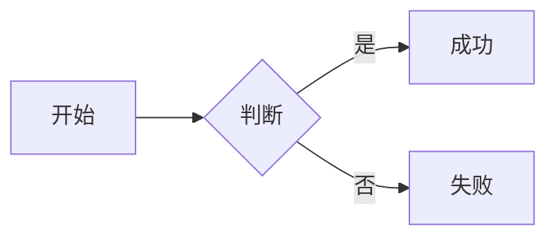
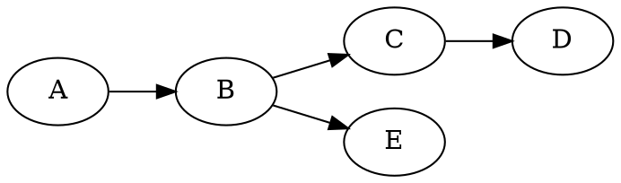

> 本文是《博客书写规范》的下半部分。上半部分（项目、目录与写作流程）见 [《博客书写规范（一）：项目、目录与写作流程》](/zh/posts/规范与流程/)。

## 六、Markdown 扩展能力清单

### 6.1 基础 Markdown（GFM）

| 元素 | 语法 | 备注 |
|------|------|------|
| 二级标题 | `## 标题` | 正文从 `##` 开始 |
| 三级标题 | `### 标题` | |
| 粗体 | `**粗体**` | |
| 斜体 | `*斜体*` | |
| 删除线 | `~~text~~` | GFM 扩展 |
| 行内代码 | `` `code` `` | |
| 链接 | `[文字](url)` | |
| 自动链接 | `<https://...>` | |
| 高亮 | `==text==` | 自定义 shortcode，黄色背景 |
| 无序列表 | `- item` | |
| 有序列表 | `1. item` | |
| 任务列表 | `- [x]` / `- [ ]` | GFM |
| 引用 | `> text` | 可嵌套 `> >` |
| 脚注 | `[^id]` + `[^id]: 内容` | 编号全局唯一 |
| 表格 | `\| a \| b \|` | 见 6.7 坑点 |
| 水平线 | `---` | |
| 键盘 | `<kbd>Ctrl</kbd>` | HTML 直写 |
| 下标 | `<sub>2</sub>` | HTML 直写 |
| 上标 | `<sup>2</sup>` | HTML 直写 |
| 小字 | `<small>text</small>` | HTML 直写 |

### 6.2 代码块（语法高亮）

````markdown
```python
def fib(n):
    return n if n < 2 else fib(n-1) + fib(n-2)
```
````

支持语言：`python` `javascript` `typescript` `bash` `sql` `go` `json` `toml` `yaml` `html` `css` `rust` `java` `c` `cpp` 等（highlight.js autodetect）。

代码块右上角悬停有「Copy」按钮（`components/PostBody.tsx` 客户端注入）。

### 6.3 数学公式（KaTeX）

#### 行内

```markdown
质能方程 $E = mc^2$，欧拉公式 $e^{i\pi} + 1 = 0$。
```

#### 块级

```markdown
$$
\int_{-\infty}^{\infty} e^{-x^2} \, dx = \sqrt{\pi}
$$
```

#### 自定义宏（`lib/markdown.ts` 已注册）

| 宏 | 展开为 |
|------|------|
| `\RR` | `\mathbb{R}` |
| `\CC` | `\mathbb{C}` |
| `\ZZ` | `\mathbb{Z}` |
| `\NN` | `\mathbb{N}` |
| `\QQ` | `\mathbb{Q}` |
| `\dd` | `\mathrm{d}` |

写 `$\RR$` 直接得到实数集 ℝ。

#### 常用示例

矩阵：

```latex
$$
\begin{bmatrix} a & b \\ c & d \end{bmatrix}
\begin{bmatrix} x \\ y \end{bmatrix}
=
\begin{bmatrix} ax + by \\ cx + dy \end{bmatrix}
$$
```

分段函数：

```latex
$$
f(x) = \begin{cases} x^2, & x \geq 0 \\ -x, & x < 0 \end{cases}
$$
```

#### 超宽公式怎么处理（很重要）

块级公式**不换行**（KaTeX 输出 `white-space: nowrap`），比阅读宽度还长时只有两个结局：
溢出卡片，或者横向滚动。两种都不好——滚动会让读者永远只看到半截。
所以本站的做法是：**太宽的公式自动等比缩小**。

手机与桌面的差异很大，这一点最容易误判：

| 环境 | 卡片可用宽 | 同一条 1000px 公式需要缩到 |
|------|-----------|--------------------------|
| 桌面 | ≈ 768px | 0.77 |
| 手机 | ≈ 340px | 0.34 |

所以早期「低于下限就不缩」的策略在手机上会直接放弃：桌面看着修好了，手机却毫无变化。
现在是**尽力缩到下限为止**，缩不到的部分交给横向滑动：

```
装得下          → 原尺寸居中
要缩到 ≥ 0.5    → 缩小到刚好放下（无滑动）
需要缩到 < 0.5  → 缩到 0.5（仍可读），剩下的横向滑
```

横向滑动时会在右缘画一道**渐隐**。这道渐隐不是装饰：移动端不显示滚动条，
没有它的话「右半边被裁掉」与「内容被截断」看起来一模一样，读者不会知道能往左滑。

所以写公式时**不需要**为了适配而手工拆行或改小，直接写完整式即可。
若某条公式在手机上被缩得太狠、看不清，再考虑改成多行（`\begin{aligned}` / `\begin{split}`）。

实现要点（`components/PostBody.tsx` + `globals.css`）：

- 缩的是 **font-size，不是 `transform: scale`**。KaTeX 内部全用 em 计量，
  改字号会真实改变布局宽度；而 scale 不行——`.katex-display` 本身就是
  `overflow-x: auto` 的裁剪容器，CSS 是「先裁剪再缩放」，被裁掉的右半截
  不会因为缩放重新出现。
- 量宽度用**容器自己的 `scrollWidth`**，不是量子元素的盒子宽度。
  KaTeX 的 `.katex-display` 是 `<span>`（inline），而 inline 框上
  `overflow` / `max-width` 全部无效 —— 所以 CSS 里用
  `.article .katex-display` + `!important` 把 `display: block` 钉死，
  不依赖 CDN 样式是否可达、也不受样式表先后顺序影响。
- 居中不能用 KaTeX 自带的 `text-align: center`：内容超宽时会把溢出均分到两侧，
  左半边落在滚动起点之前、永远滚不到。改用「内容宽 + auto 边距」。
- 每个公式盒上会写一个 `data-formula-fit` 属性，调试时看元素属性即可：

| 值 | 含义 |
|------|------|
| `ok` | 本来就装得下，没动 |
| `fit:0.82` | 缩到 82% 后完全放下了，不需要滑动 |
| `scroll:0.5` | 已缩到下限 0.5，剩下的靠横向滑动（右缘有渐隐） |

### 6.4 化学式（mhchem）

用 `\ce{...}` 包裹，行内和块级都行。

```markdown
水是 $\ce{H2O}$，硫酸是 $\ce{H2SO4}$。

$$\ce{2H2 + O2 -> 2H2O}$$

$$\ce{N2(g) + 3H2(g) <=>[高温、高压][催化剂] 2NH3(g)}$$

$$\ce{Ag+ + Cl- -> AgCl v}$$      <- v 表示沉淀
$$\ce{Zn + 2H+ -> Zn^{2+} + H2 ^}$$ <- ^ 表示气体
```

### 6.5 化学结构式（SmilesDrawer shortcode）

```markdown



```

**支持三种格式**（`lib/markdown.ts` 的 `remarkCustomShortcodes`）：

1. `` — 仅 SMILES
2. `` — 仅 SMILES（无引号）
3. `` — 完整版

**SMILES 字符串从 [PubChem](https://pubchem.ncbi.nlm.nih.gov/) 查询**，复制 "Canonical SMILES" 或 "Isomeric SMILES"。

> ⚠️ **坑**：SMILES 错误会渲染出错误结构但不会报错。复杂分子（如含 S 的 β-内酰胺类）务必核对硫原子等关键元素是否在 SMILES 里。

### 6.6 颜色与标记 shortcode

#### 行内彩色文字

```markdown


```

支持 9 种预设色名：`red` `orange` `yellow` `green` `cyan` `blue` `purple` `pink` `gray`/`grey`，也可传 hex。

#### 黄色高亮标记

```markdown
这是 ==内联高亮== 文字（双等号语法）。
```

### 6.7 表格（含坑点）

#### 基础

```markdown
| 姓名 | 年龄 | 城市 |
|------|------|------|
| 张三 | 25   | 北京 |
```

#### 对齐

```markdown
| 左对齐 | 居中  | 右对齐 |
|:-------|:----:|-------:|
| 左     |  中  |     右 |
```

#### ⚠️ 表格内的绝对值符号 `|` 必须转义

表格单元格用 `|` 分隔，如果内容写 `$y = |f(x)|$`，里面的 `|` 会被误判为列分隔符，**表格错乱**。

**错误**：

```markdown
| 解析式 |
|--------|
| $y = |f(x)|$ |
```

**正确**（用 `\lvert` / `\rvert`）：

```markdown
| 解析式 |
|--------|
| $y = \lvert f(x) \rvert$ |
```

`\lvert` / `\rvert` 在 KaTeX 下渲染效果和 `|` 一样，且不冲突。**表格内的绝对值、范数、分段函数边界都用这两个命令**。

#### ⚠️ 表格内行内化学公式的下标 `_` 转义

`$...$` 行内公式里的下划线会被 Markdown 误判为斜体，**必须写成 `\_{}`**：

```markdown
碳-14：$\ce{^{14}\_{6}C}$     <- 正确
```

块级公式 `$$...$$` 里不需要转义。

### 6.8 图表与乐谱（代码块触发）

全部浏览器端渲染，无需后端。在 `components/PostBody.tsx` 客户端扫描 `.mermaid` / `.echarts` / `.graphviz` / `.abc` 类的 `<div>` 并加载对应库。

#### Mermaid（流程图 / 时序图 / 甘特图 / 饼图 等）

````markdown

````

关键字换类型：`flowchart TD` / `sequenceDiagram` / `gantt` / `pie showData` / `classDiagram` / `stateDiagram-v2` / `gitGraph`。自动适配明/暗主题。

#### ECharts

写法一（直接 JSON）：

````markdown
```echarts
{
  "title": { "text": "访问来源", "left": "center" },
  "tooltip": { "trigger": "item" },
  "series": [{
    "type": "pie",
    "radius": ["40%", "70%"],
    "data": [
      { "value": 1048, "name": "搜索引擎" },
      { "value": 735,  "name": "直接访问" }
    ]
  }]
}
```
````

写法二（需要变量计算时写完整 JS，结果赋给 `__opt`）：

````markdown
```echarts
var months = ['1月','2月','3月'];
var uv = [820, 932, 901];
__opt = {
  title: { text: 'UV 趋势' },
  xAxis: { type: 'category', data: months },
  series: [{ name: 'UV', type: 'line', data: uv }]
};
```
````

容器自动设最小高度 360px，带 `ResizeObserver` 响应式。

#### Graphviz DOT

````markdown

````

#### abc.js 五线谱

````markdown
```abc
T:小星星
M:4/4
L:1/4
K:C
C C G G | A A G2 | F F E E | D D C2 |
```
````

### 6.9 图片

#### 推荐：绝对路径

图片放 `public/` 下的任意子目录（建议 `public/images/<主题>/`），正文用**以 `/` 开头的绝对路径**：

```markdown

*图 1：动物细胞结构。图源：XXX*
```

文件位置与 URL 的对应关系很简单：`public/` 就是 URL 的根。

| 文件 | URL |
|------|-----|
| `public/helloworld/wunailogo.png` | `/helloworld/wunailogo.png` |
| `public/images/奎宁/结构.png` | `/images/奎宁/结构.png` |

#### ⚠️ 相对路径的坑（很容易踩）

写 `` 这种**不以 `/` 开头**的相对路径时，`rehypeImages` 会把它补成
`/<lang>/posts/<slug>/<src>`：

```markdown
<!-- md 文件：content/zh/posts/你好世界.md -->

      ↓ 实际请求
/zh/posts/你好世界/helloworld/wunailogo.png   ← 404！
```

也就是说，用相对路径时图片必须真的放在
`public/zh/posts/你好世界/helloworld/` 下 —— 要在 `public/` 里手工搭出和文章 URL 一样的
**目录层级**，很容易搞错。

**除非你有明确的建目录需求，一律用绝对路径。**

#### 资源外链

```markdown

```

注意：外链图片可能被对方站点限制外链（防盗链），也可能随时失效。重要配图建议存到 `public/` 下自己托管。

外链图会带上 `referrerpolicy="no-referrer"`（在 `rehypeImages` 里统一加）：
不少图床按 Referer 做防盗链，带上来路会被直接拒，表现就是“外链图怎么都不显示”。

#### 图片加载失败时的表现

图没加载出来时不会只丢一个碎片图标，而是换成一块带 `alt` 文字的虚线占位：

```
[图片未找到]  OpenGL固定功能管线与可编程管线对比示意图
```

实现：`components/PostBody.tsx` 给正文每张图挂了 error 监听（已加载完但
`naturalWidth === 0` 的也当失败，这种情形容错器已经不再触发 error），
失败时把 `` 换成 `.figure-missing` 块（样式在 `globals.css`）。

看到这个占位块时，依次查三件事：

1. **文件到底在不在仓库里**——这是最常见的原因。如 `/images/shader/x.png`
   就要有 `public/images/shader/x.png`；目录不存在就是整篇图全挂。
   AI 生成的文章很容易编出一整组看起来很像回事但实际不存在的图片路径。
2. 路径大小写与拼写（服务器区分大小写）。
3. 外链是否被对方拒绝（看 Network 里的状态码）。

### 6.10 参考文献引用

在 frontmatter 写 `references` 数组，正文里用 `[reference:N]`（N 从 1 开始）引用：

```yaml
references:
  - title: "CommonMark 规范"
    author: "CommonMark"
    year: "2024"
    url: "https://commonmark.org/"
```

```markdown
本文参考了 CommonMark 规范[reference:1]。
```

`[reference:1]` 会被自动渲染为上标可点击编号 `[1]`，文末自动生成「参考文献」节。

### 6.11 中文排版自动优化

`lib/markdown.ts` 的 `rehypeCjkOpt` 插件自动：

- CJK 与 ASCII 字母/数字之间加空格：`使用React框架` → `使用 React 框架`
- 中文语境下标点转换：`,.?!;:` → `，。？！；：`，`()` → `（）`，`[]` → `【】`
- **跳过 KaTeX 渲染出的 HTML 内部**，避免破坏公式排版

写文章时**不需要手动加这些空格和标点**，让插件处理。

### 6.12 XSS 过滤

`rehypeXssFilter` 拦截 `javascript:` / `vbscript:` / `data:` 协议的链接，自动改成 `#`。

```markdown
[危险链接](javascript:alert('xss'))   <- 渲染后变成 #
```

### 6.13 shortcode 转义（在文章里展示 shortcode 代码）

要显示 shortcode 原始代码而不执行，内部加 `/* */`：

````markdown
显示原始代码（不执行）：

实际执行（渲染结构式）：
````

> ⚠️ **标题、表格里的 shortcode 必须转义**，否则 Markdown 解析报错。

---

## 七、AI 写作硬性约束（写给 AI 的提示词）

> 当 AI 被指派写/改本站 Markdown 文章时，必须遵守以下硬性约束。**违反任一条都会导致渲染错误**。

### 7.1 代码围栏

1. ` ``` ` 代码围栏的**语言标识符必须和反引号在同一行**（如 ```` ```python ````），**绝不允许把语言名拆到下一行**。
2. 若在对话中展示整篇 md，外层用 **4 反引号** ```` ```` ```` 包裹，避免和内层 3 反引号冲突。

### 7.2 表格

1. 表格内的绝对值符号 `|` 必须写成 `\lvert` / `\rvert`，不能出现裸 `|`。
2. 表格内的行内化学公式下标必须写成 `\_{}`（如 `\ce{^{14}\_{6}C}`）。
3. 表格内 shortcode 必须转义（内部加 `/* */`）。

### 7.3 shortcode

1. shortcode 出现在标题或表格中，必须转义。
2. `chem` shortcode 的 SMILES 字符串必须从 PubChem 查询，**不要凭记忆编造**——复杂分子的特征原子（如 β-内酰胺类的硫）容易遗漏，导致渲染出错误结构。

### 7.4 Frontmatter

1. `title` 必填，作为 H1，正文里不要再写 `# 标题`。
2. `date` 用 `YYYY-MM-DD` 格式，影响排序。
3. `author` 按事实填：AI 生成/整理/润色一律写 `"AI"`，纯人工写 `"wunai"`。
4. TOML frontmatter（`+++`）必须在文件第 1 行，前面不能有空行。

### 7.5 标题层级

正文从 `##`（二级标题）开始，不要写 `#`（H1 已被 title 占用）。

### 7.6 图片

1. 单文章配图放 `public/images/<文章目录>/`，正文用绝对路径 `/images/...`。
2. 不要用临时图床链接（会失效）。

### 7.7 文件命名

1. 文件名建议中文（会作为 URL slug），避免特殊字符 `/ \ : * ? " < > |`。
2. 中英文版同名（`content/zh/posts/X.md` ↔ `content/en/posts/X.md`），URL 才能对应。

### 7.8 完整 AI 提示词模板

把下面这段贴到 AI 对话里，让 AI 写文章前先读：

```
请按 wunai's blog 的书写规范写一篇 Markdown 文章。

硬性约束：
1. 代码围栏语言标识符与反引号同一行（如 ```python），绝不换行。
2. 表格内绝对值用 \lvert \rvert，不用裸 |。
3. 表格内行内化学公式下标用 \_{}。
4. shortcode 在标题/表格中必须转义（加 /* */）。
5. chem shortcode 的 SMILES 必须从 PubChem 查询，不编造。
6. frontmatter 用 YAML，title 必填，date 用 YYYY-MM-DD。
7. author 按事实填：AI 生成写 "AI"，人工写 "wunai"。
8. 正文从 ## 二级标题开始，不写 # H1。
9. 配图放 public/images/<目录>/，用绝对路径。
10. 文件名中文，避免特殊字符。

完整规范见 /zh/posts/博客书写规范/。
```

---

## 八、部署与运维

### 8.1 构建命令

`package.json` 的 `prebuild` 钩子先跑两个生成脚本：

```json
"scripts": {
  "prebuild": "node scripts/generate-search-index.mjs && node scripts/generate-rss.mjs",
  "dev": "next dev",
  "build": "next build",
  "start": "next start",
  "lint": "eslint"
}
```

执行 `npm run build` 时：

1. `generate-search-index.mjs` 扫描 `content/<lang>/posts/`，过滤 draft，生成 `public/search-index.<lang>.json`（slug/title/summary/tags/content 前 2000 字）。
2. `generate-rss.mjs` 扫描同样目录，按 date 降序取前 20 篇，生成 `public/rss.xml`。
3. `generate-changelog.mjs` 取最近 5 次提交（日期/首行信息/短 sha/GitHub 链接），生成 `public/changelog.json`，供首页「最近更新」区块使用。它**优先走 GitHub API**（`actions/checkout` 与 Cloudflare Pages 都是浅克隆，`git log` 取不到 5 条），失败时回退 `git log`；两个来源都失败则保留旧文件、绝不令构建失败。
4. `next build` 调用 `lib/content.ts` 的 `getPosts` 为每篇文章预渲染 HTML，输出到 `out/`。

### 8.2 Cloudflare Pages 部署

`my-app/wrangler.toml`：

```toml
name = "wunai-blog"
compatibility_date = "2024-01-01"
pages_build_output_dir = "out"
```

- 推 `main` → Cloudflare 自动跑 `npm run build` → 部署 `out/`（根目录必须是 `my-app`，原因见《博客书写规范（一）》的 4.3 节）。
- 本地手动：`npx wrangler pages deploy out`。

### 8.3 域名

- 生产：https://blog.wunai.top
- `lib/site.ts` 的 `SITE.url` 是 `https://blog.wunai.top`。另外 `scripts/generate-rss.mjs` 的 `BASE` 是**硬编码的**，换域名时两处都要改；`app/sitemap.ts` 与 `app/robots.ts` 都从 `SITE.url` 取值，不用动。

### 8.4 PWA / Service Worker

`public/sw.js` 策略：

- **预缓存**：`/`、`/zh/`、`/offline.html`、`/manifest.webmanifest`。
- **同源静态资源**（css/js/字体/图片/json）：cache-first。
- **同源 HTML**：SWR（stale-while-revalidate）——先用缓存立刻响应，后台拉新版本更新缓存。
- **跨域 CDN**：network-first，失败回退缓存。
- **版本**：当前 `v3`。**改完 sw.js（或任何静态资源策略）必须升 VERSION**，否则 `activate` 不会删旧缓存，客户端会一直用旧 chunk（详见 Q8）。

`app/layout.tsx` 在 `<body>` 末尾注册 SW。

### 8.5 评论

`components/Comments.tsx` 用 Giscus（基于 GitHub Discussions），repo 配置：

```
data-repo = "wunai-xc/hugo-blog"
data-repo-id = "R_kgDON7BcXg"
data-category = "Announcements"
data-category-id = "DIC_kwDON7BcXs4CmI5i"
```

滚动到评论区附近才懒加载，避免首屏开销。明暗主题随 `<html>` 的 `.dark` 类切换。

### 8.6 SEO

- `app/sitemap.ts`：自动生成 `/sitemap.xml`，含首页、列表页（含友链页）、所有文章页。
- `app/robots.ts`：`/robots.txt`，`allow: /`，指向 sitemap。
- 文章详情页注入 [JSON-LD](https://schema.org/BlogPosting) 结构化数据（`app/[lang]/posts/[slug]/page.tsx`），含 headline/keywords/wordCount/inLanguage/datePublished/author。
- `app/layout.tsx` 配置 OpenGraph / Twitter Card / canonical / alternates（zh-CN / en-US）。

### 8.7 打印 / 导出 PDF

任意文章页按 `Ctrl+P`（macOS `Cmd+P`），或点页头右侧的两个按钮（`components/PrintControls.tsx`）：

| 按钮 | 行为 |
|------|------|
| 打印（`t.printSingle`） | 调 `window.print()`，在浏览器打印对话框里选「另存为 PDF」 |
| 下载 MD（`t.mdDownload`） | 前端用 `buildFullMarkdown()` 重建含 frontmatter 的原文，Blob 下载为 `<slug>.md` |

> 组件内的默认文案是「制作PDF」，但文章页传入的 `printSingle` 是「打印」，所以页头实际显示的是「打印」。

打印时 `@media print` 会自动：

- **隐藏**：顶栏、页脚、上下篇、评论、面包屑、浮动导航（目录按钮/面板/进度滑块/回到顶部）、点网格背景、向下滑动图标、「继续阅读」按钮、打印按钮自身
- **去掉亚克力**：阅读面与卡片均 `background: none` + `backdrop-filter: none`，`position/z-index` 归零（否则 PDF 背景发灰、分页错乱）
- **禁用入场动画**：避免加载后立即打印截到动画中间态
- **强制白底黑字**（暗色主题也回白底），正文字号压到 11px、代码 10px、表格 10px，A4 密度合理
- **首页特例**：取消「关于」正文的裁切、渐入元素直接显示，使 PDF 得到全文
- **链接附 URL**：只给站外链接（`a[href^="http"]`）附 URL；锚点、表格内、代码内的链接一律不附（长 URL 会撑宽表格列、搅乱分页）
- **表格**：表头每页重复（`display: table-header-group`），单行不被切开，表头不单独留在页尾；表头底与斑马底都补了 `print-color-adjust: exact`，否则打印时会被浏览器丢掉
- **表格必须改回真表格**：屏幕版 `.article table` 是 `display: block` + `overflow-x: auto` 的横向滚动容器，打印时要覆盖成 `display: table` + `overflow: visible` —— 否则 `thead` 的每页重复失效、超出页宽的部分被裁掉
- **代码块**：允许跨页（`break-inside: auto` + `white-space: pre-wrap`），配 `orphans/widows` 避免页边只剩一行；`box-decoration-break: clone` 让每页那段都带内边距和底色，断开处不贴边
- **分页衔接**：标题带 `break-after: avoid`，不会孤零零留在页尾；段落 `orphans/widows: 2`；图片、化学结构图仍整体不断页
- **不打印**：标签、AI 红色警示徽章（作者灰色徽章保留，但去掉边框）

**页眉页脚**：用 `@page` 的页边距盒自己控制：

| 位置 | 内容 |
|------|------|
| 页眉左（`@top-left`） | 打印日期时间 · 作者，如 `2026-09-14 12:34 · wunai` |
| 页脚左（`@bottom-left`） | 文章标题 |
| 页脚右（`@bottom-right`） | `counter(page) " / " counter(pages)`，即「当前页 / 总页数」 |

同侧其余盒（`@top-center`、`@top-right`、`@bottom-center`）显式留空。浏览器会在「作者定义了页边距盒」的那条边上抑制自带的页眉页脚，所以不必再让读者去打印对话框里手动取消勾选。

两个实现细节：

- **边距单独写一条 `@page`**（`margin: 1.5cm`），页边距盒写在另一条里。旧浏览器解析不了页边距盒时只会丢掉后一条，不会连边距一起丢。
- 该能力需要 **Chrome / Edge 131+（或 Safari）**。更旧的浏览器会忽略整条规则，退回浏览器自带的页眉页脚（含 URL 与时间）。

**页眉页脚里的动态文本怎么来的**：页边距盒里只能用 `content` 描述，既取不到当前时间，也读不到 DOM 文本。所以由 `components/PrintControls.tsx` 把它们注入成 CSS 自定义属性：

```css
@top-left    { content: var(--print-header, ""); }
@bottom-left { content: var(--print-title, ""); }
```

- 值必须是合法的 `<content-list>`，字符串要带引号，所以 JS 侧用 `JSON.stringify` 生成（顺带转义标题里的引号与反斜杠）：`--print-header: "2026-09-14 12:34 · wunai"`。
- 两个属性都带 `""` 兜底。自定义属性缺失时 `content` 会整条失效，加兜底可退化成「不显示」而不是规则报错。
- 时间戳在组件挂载时写入，并监听 `beforeprint` 刷新——这样点「打印」按钮和直接按 `Ctrl+P` 都能拿到接近打印时刻的时间。
- 页边距盒所在的 page context 继承自根元素，所以写在 `document.documentElement` 上的自定义属性能被页边距盒读到。非文章页没有 `PrintControls`，属性缺失，页眉与页脚左自动为空，只留页码。

> 注：早先一版在表格表头用 `thead::before { content: "续表（第 N 页）" }` 做续页标记，但它无法区分首页与续页（首页表头也会被标成「续表」），已移除，改为靠右下角的页码定位。

---

## 九、本地开发命令速查

| 命令 | 作用 |
|------|------|
| `npm run dev` | 本地开发（含草稿），http://localhost:3000 |
| `npm run build` | 生产构建到 `out/`（含搜索索引和 RSS 生成） |
| `npm run start` | 启 Next.js 生产服务器。**注意：本项目 `output: "export"`，`next start` 不适用于静态导出**，预览请用 `npx serve out` |
| `npm run lint` | ESLint 检查 |
| `npx serve out` | 本地预览构建产物 |
| `npx wrangler pages deploy out` | 手动部署到 Cloudflare Pages |

---

## 十、常见问题排查

### Q1：代码块没有语法高亮颜色

**A**：检查代码围栏的语言标识符是否和反引号同一行。AI 常犯的错：

````markdown
```              <- 错：语言名单独一行
python
def f(): pass
```
````

正确：

````markdown
```python
def f(): pass
```
````

### Q2：表格错位、列数对不上

**A**：检查单元格内是否有裸 `|`（绝对值/范数）。改用 `\lvert` / `\rvert`。

### Q3：化学结构式渲染出来不对（缺原子、键错）

**A**：SMILES 字符串错误。去 [PubChem](https://pubchem.ncbi.nlm.nih.gov/) 搜索化合物，复制 "Canonical SMILES" 或 "Isomeric SMILES"。复杂分子（如含硫的 β-内酰胺类）务必核对特征原子是否在 SMILES 里。

### Q4：数学公式不渲染，显示原始 `$...$`

**A**：检查 `$` 两侧是否有空格干扰。`$E=mc^2$` 正常，`$ E = mc^2 $`（带前后空格）可能被当成美元符号。块级 `$$...$$` 必须独占一行。

### Q5：文章不显示在列表

**A**：检查 `draft` 是否为 `true`（不发布）；或 `hiddenInHomeList` 是否为 `true`（首页不显示但 URL 可访问）。

### Q6：AI 文章排在了人工文章前面

**A**：这是设计行为。`lib/content.ts` 把非 AI 文章全部排在 AI 文章之前。想让 AI 文章靠前只能在 AI 文章组内靠 date 调整。

### Q7：换域名后 RSS / sitemap 还是旧域名

**A**：要改三处：`lib/site.ts` 的 `SITE.url`、`scripts/generate-rss.mjs` 的 `BASE` 常量、`app/sitemap.ts` 的 `base` 常量。

### Q8：Service Worker 不更新 / 部署后无法跳转

**A**：`public/sw.js` 的 `VERSION` 必须升级（如 `v2` → `v3`）。

**典型症状**：页面能正常打开，但**点链接跳转没反应**（本站加载遮罩会一直转，因为它的退出条件只等 `pathname` 变化）。

**成因**：静态资源（`.js` / `.json`）是 cache-first，而缓存名带着 `VERSION` —— 只要 `VERSION` 不变，旧 chunk 永远不会被清。于是多次部署后出现错配：HTML 走 SWR 很快拿到新版本，但页面里正在跑的 JS 仍是缓存中的旧 chunk，“旧客户端 + 新部署的 RSC 数据”对不上，客户端路由跳转就失败。

**急救**：长按刷新 / 清除站点数据 / 无痕窗口，可立即绕过；根治就是升 VERSION。

### Q9：评论不显示

**A**：`components/Comments.tsx` 的 Giscus 配置硬编码了 repo `wunai-xc/hugo-blog`。换仓库要改 `data-repo` / `data-repo-id` / `data-category-id`（去 [giscus.app](https://giscus.app) 重新生成）。

### Q10：图标不显示

**A**：`lib/icons.ts` 显式 import 了用到的 MDI 图标。新增图标要在这里 import 并加到 `icons` 对象，否则 **`next build` 会因 TS7053 类型错误直接失败**（比运行时 undefined 更早暴露）。

---

## 十一、规范维护

本文档（`content/zh/posts/博客书写规范/`）是**单一信息源**。任何关于：

- 新增 shortcode
- 新增 Markdown 扩展
- 改 frontmatter 字段
- 改排序规则
- 改 AI 标记逻辑
- 改部署流程

都要**先改本文档，再改代码**。代码与文档不一致时，以本文档为准，代码应被修正。

旧版速查 `content/zh/posts/写作模板.md`（`draft = true`）可保留作历史参考，但**所有新约定以本文档为准**。

---

## 附录：完整目录树（精简版）

```
my-app/
├── app/                    # 路由层（App Router）
│   ├── [lang]/              # zh / en 动态语言
│   │   ├── posts/[slug]/   # 文章详情
│   │   ├── groups/[slug]/  # 卡组（文章组）详情；注意标签详情页仍在 tags/[tag]/
│   │   ├── links/          # 友链页
│   │   ├── tags/[tag]/     # 标签页
│   │   ├── categories/[category]/
│   │   ├── archives/        # 归档
│   │   └── search/          # 搜索
│   ├── layout.tsx           # 根布局
│   ├── page.tsx             # / → /zh/
│   ├── globals.css          # 全站样式
│   ├── sitemap.ts            # sitemap.xml
│   └── robots.ts             # robots.txt
├── components/              # 18 个 React 组件
├── lib/                     # site.ts / content.ts / links.ts / markdown.ts / icons.ts
├── content/                 # Markdown 源
│   ├── zh/posts/            # 中文文章
│   └── en/posts/            # 英文文章
├── public/                  # 静态资源 + sw.js + manifest + rss + 搜索索引
├── scripts/                 # 构建前置脚本（搜索索引、RSS）
├── next.config.ts           # output="export"
├── tsconfig.json            # @/* 路径别名
├── wrangler.toml            # Cloudflare Pages
└── package.json             # 依赖 + prebuild 钩子
```
